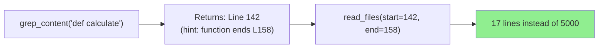
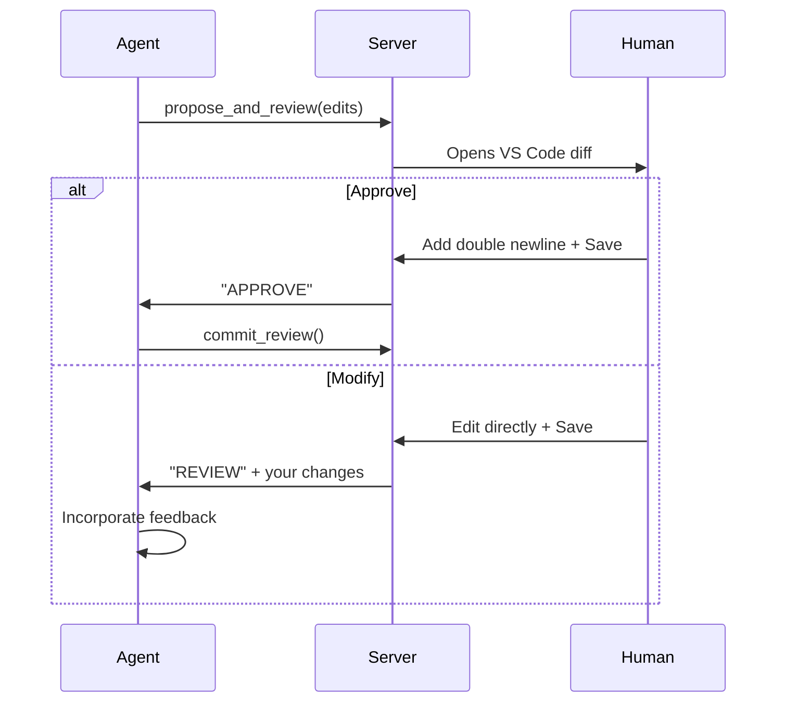

# fs-mcp 📂

**Universal, Provider-Agnostic Filesystem MCP Server**

*Works with Claude, Gemini, GPT — zero configuration required.*

---

https://github.com/user-attachments/assets/132acdd9-014c-4ba0-845a-7db74644e655

## 💡 Why This Exists

MCP (Model Context Protocol) is incredible, but connecting AI agents to filesystems hits real-world walls:

| Problem | fs-mcp Solution |
|---------|-----------------|
| **Container Gap** — Stdio doesn't work across Docker boundaries | HTTP server by default — connect from anywhere |
| **Token Waste** — Agents dump entire files to find one function | Smart `grep → read` pattern with section hints |
| **Schema Hell** — Gemini silently corrupts nested object schemas | Auto-transforms schemas at runtime — just works |
| **Blind Overwrites** — One hallucination wipes your `main.py` | Human-in-the-loop review with VS Code diff |

**fs-mcp** is a Python-based server built on `fastmcp` that treats **efficiency**, **safety**, and **universal compatibility** as first-class citizens.

---

## 🚀 Core Value

### 1. Agent-First Efficiency

Tools are designed to minimize token usage and maximize context quality:



- **Section Hints**: `grep_content` tells you where functions/classes end
- **Pattern Reading**: `read_files` with `read_to_next_pattern` extracts complete blocks
- **Token-Efficient Errors**: Fuzzy match suggestions instead of file dumps (90% savings)

### 2. Human-in-the-Loop Safety

The `propose_and_review` tool opens a VS Code diff for every edit:



**Safety features:**
- Full overwrites require explicit `OVERWRITE_FILE` sentinel
- Batch edits with `edits=[]` for multiple changes in one call
- Session-based workflow prevents race conditions

### 3. Universal Provider Compatibility

**The problem:** Gemini silently corrupts JSON Schema `$ref` references — nested objects like `FileReadRequest` degrade to `STRING`, breaking tool calls.

**The fix:** fs-mcp automatically transforms all schemas to Gemini-compatible format at startup. No configuration needed.

```
Before (broken):     "items": {"$ref": "#/$defs/FileReadRequest"}
                              ↓ Gemini sees this as ↓
                     "items": {"type": "STRING"}  ❌

After (fs-mcp):      "items": {"type": "object", "properties": {...}}  ✅
```

This "lowest common denominator" approach means **the same server works with Claude, Gemini, and GPT** without any provider-specific code.

---

## ⚡ Quick Start

### Run Instantly

```bash
# One command — launches Web UI (8123) + HTTP Server (8124)
uvx fs-mcp .
```

### Selective Launch

```bash
# HTTP only (headless / Docker / CI)
fs-mcp --no-ui .

# UI only (local testing)
fs-mcp --no-http .
```

### Docker

```bash
# In your Dockerfile or entrypoint
uvx fs-mcp --no-ui --http-host 0.0.0.0 --http-port 8124 /app
```

---

## 🔌 Configuration

### Claude Desktop (Stdio)

```json
{
  "mcpServers": {
    "fs-mcp": {
      "command": "uvx",
      "args": ["fs-mcp", "/path/to/your/project"]
    }
  }
}
```

### OpenCode / Other HTTP Clients

Point your MCP client to `http://localhost:8124/mcp/` (SSE transport).

---

## 🧰 The Toolbox

### Discovery & Reading

| Tool | Purpose |
|------|---------|
| `grep_content` | Regex search with **section hints** — knows where functions end |
| `read_files` | Multi-file read with `head`/`tail`, line ranges, or `read_to_next_pattern` |
| `directory_tree` | Recursive JSON tree (auto-excludes `.git`, `.venv`, `node_modules`) |
| `search_files` | Glob pattern file discovery |
| `get_file_info` | Metadata + token estimate + chunking recommendations |

### Editing (Human-in-the-Loop)

| Tool | Purpose |
|------|---------|
| `propose_and_review` | **Safe editing** — VS Code diff, batch edits, fuzzy match suggestions |
| `commit_review` | Finalize approved changes |

### Structured Data

| Tool | Purpose |
|------|---------|
| `query_json` | JQ queries on large JSON files (bounded output) |
| `query_yaml` | YQ queries on YAML files |

### Utilities

| Tool | Purpose |
|------|---------|
| `list_directory_with_sizes` | Detailed listing with formatted sizes |
| `list_allowed_directories` | Show security-approved paths |
| `create_directory` | Create directories |
| `read_media_file` | Base64 encode images/audio for vision models |

### Analysis

| Tool | Purpose |
|------|---------|
| `analyze_gsd_work_log` | Semantic analysis of GSD-Lite project logs |

---

## 🏗️ Architecture

```
src/fs_mcp/
├── server.py          # Tool definitions + schema transforms
├── gemini_compat.py   # JSON Schema → Gemini-compatible
├── edit_tool.py       # propose_and_review logic
├── web_ui.py          # Streamlit dashboard
└── gsd_lite_analyzer.py

scripts/schema_compat/ # CLI for schema validation
tests/                 # pytest suite (including Gemini compat CI guard)
```

**Key dependency:** `ripgrep` (`rg`) must be installed for `grep_content`.

---

## 📊 Why Token Efficiency Matters

| Scenario | Without fs-mcp | With fs-mcp |
|----------|----------------|-------------|
| Find a function | Read entire file (5000 tokens) | grep + targeted read (200 tokens) |
| Edit mismatch error | Dump file + error (6000 tokens) | Fuzzy suggestions (500 tokens) |
| Explore large JSON | Load entire file (10000 tokens) | JQ query (100 tokens) |

**Result:** 10-50x reduction in context usage for common operations.

---

## 🧪 Testing

```bash
# Run all tests
uv run pytest

# Run Gemini compatibility guard (fails if schemas break)
uv run pytest tests/test_gemini_schema_compat.py
```

---

## 📜 License & Credits

Built with ❤️ for the MCP community by **luutuankiet**.

Powered by [FastMCP](https://github.com/jlowin/fastmcp), [Pydantic](https://docs.pydantic.dev/), and [Streamlit](https://streamlit.io/).

**Now go build some agents.** 🚀