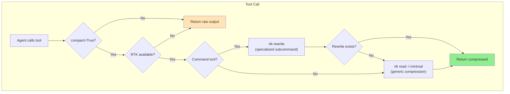
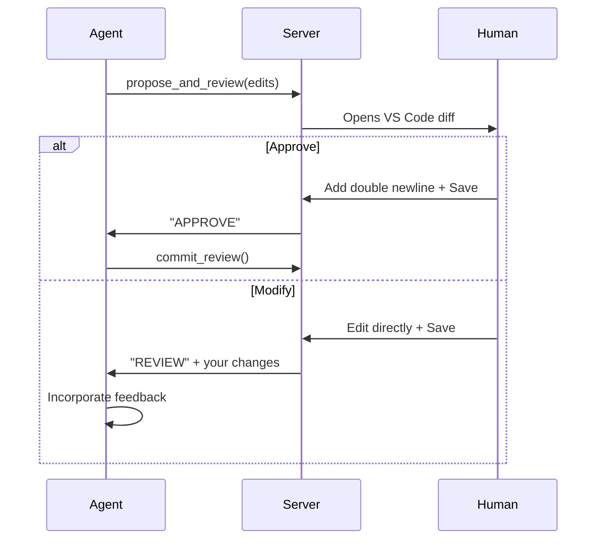
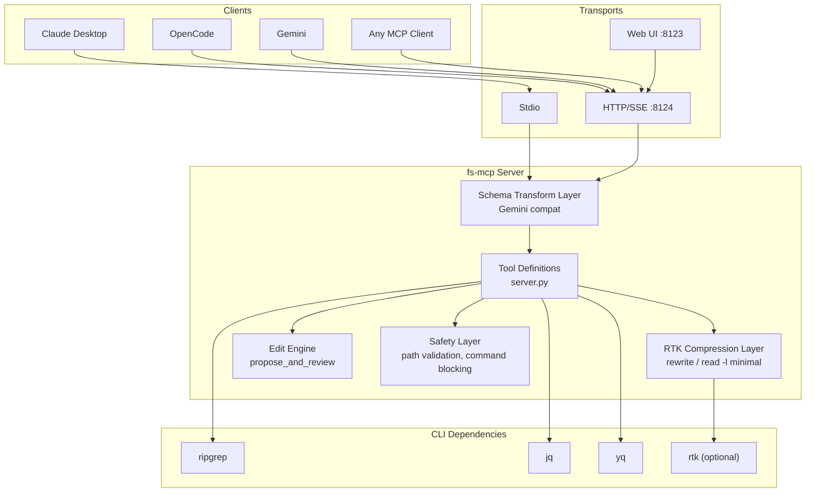

# fs-mcp :open_file_folder:

**Universal, Provider-Agnostic Filesystem MCP Server**

*Works with Claude, Gemini, GPT — zero configuration required.*

[](https://pypi.org/project/fs-mcp/)
[](https://github.com/luutuankiet/fs-mcp/actions/workflows/test-deps.yaml)
[](https://www.python.org/downloads/)

---

https://github.com/user-attachments/assets/132acdd9-014c-4ba0-845a-7db74644e655

## Why This Exists

MCP (Model Context Protocol) is incredible, but connecting AI agents to filesystems hits real-world walls:

| Problem | fs-mcp Solution |
|---------|-----------------|
| **Container Gap** — Stdio doesn't work across Docker boundaries | HTTP server by default — connect from anywhere |
| **Token Waste** — Agents dump entire files to find one function | Smart `grep -> read` pattern with section hints |
| **Schema Hell** — Gemini silently corrupts nested object schemas | Auto-transforms schemas at runtime — just works |
| **Blind Overwrites** — One hallucination wipes your `main.py` | Human-in-the-loop review with VS Code diff |
| **Verbose Output** — build/test/git output wastes context window | RTK compresses tool output 30-70% automatically |

**fs-mcp** is a Python-based server built on `fastmcp` that treats **efficiency**, **safety**, and **universal compatibility** as first-class citizens.

---

## Quick Start

### Run Instantly

```bash
# One command — launches Web UI (8123) + HTTP Server (8124)
uvx fs-mcp .
```

### Selective Launch

```bash
# HTTP only (headless / Docker / CI)
fs-mcp --no-ui .

# UI only (local testing)
fs-mcp --no-http .
```

### Docker

```bash
# In your Dockerfile or entrypoint
uvx fs-mcp --no-ui --http-host 0.0.0.0 --http-port 8124 /app
```

---

## The Toolbox

### Discovery & Reading

| Tool | Purpose |
|------|---------|
| `grep_content` | Regex search with **section hints** — knows where functions end |
| `read_files` | Multi-file read with `head`/`tail`, line ranges, `read_to_next_pattern`, or per-file `reads` arrays for multi-slice requests |
| `directory_tree` | Recursive tree explorer: compact text by default (`compact=True`), legacy JSON with `compact=False` |
| `search_files` | Glob pattern file discovery |
| `get_file_info` | Metadata + token estimate + chunking recommendations |

### Editing (Human-in-the-Loop)

| Tool | Purpose |
|------|---------|
| `propose_and_review` | **Safe editing** — VS Code diff, batch edits, fuzzy match suggestions |
| `commit_review` | Finalize approved changes |

### Structured Data

| Tool | Purpose |
|------|---------|
| `query_jq` | JQ queries on large JSON files (bounded output) |
| `query_yq` | YQ queries on structured data files (YAML, XML, TOML, CSV, TSV, INI, HCL) |

### Execution

| Tool | Purpose |
|------|---------|
| `run_command` | Run shell commands on the remote host. Supports pipes, redirects, `&&`, `\|\|`. Destructive commands (rm, kill, etc.) are blocked. Output auto-compressed via RTK when `compact=True` (default). |

**Examples:**

```python
run_command(command="make build")
run_command(command="pytest -x tests/", timeout=120)
run_command(command="git status && git log --oneline -5")
run_command(command="pip install -e '.[dev]'")
```

### Utilities

| Tool | Purpose |
|------|---------|
| `check_dependencies` | Health check for all CLI deps — versions, paths, duplicates, managed vs user-installed. Use `fix=True` to auto-update managed deps. |
| `list_directory_with_sizes` | Detailed listing with formatted sizes |
| `list_allowed_directories` | Show security-approved paths |
| `create_directory` | Create directories |
| `read_media_file` | Read images/audio — auto-uploads to [image relay](https://github.com/luutuankiet/image-relay) when `IMAGE_RELAY_URL` is set, returns download URL instead of base64. Falls back to base64 when relay is not configured. |

### Analysis

| Tool | Purpose |
|------|---------|
| `analyze_gsd_work_log` | Semantic analysis of GSD-Lite project logs |

---

## RTK Integration

[RTK](https://github.com/rtk-ai/rtk) (Rewrite ToolKit) is an optional companion that compresses tool output before it reaches the LLM, saving 30-70% of context tokens without losing semantic meaning.

### How It Works


```mermaid
flowchart TD
    subgraph "Tool Call"
        A[Agent calls tool] --> B{compact=True?}
        B -- No --> C[Return raw output]
        B -- Yes --> D{RTK available?}
        D -- No --> C
        D -- Yes --> E{Command tool?}
        E -- Yes --> F["rtk rewrite\n(specialized subcommand)"]
        E -- No --> G["rtk read -l minimal\n(generic compression)"]
        F --> H{Rewrite exists?}
        H -- Yes --> I[Return compressed]
        H -- No --> G
        G --> I
    end

    style I fill:#90EE90
    style C fill:#FFE4B5
```

**Two compression strategies:**

| Strategy | Used By | How |
|----------|---------|-----|
| **`rtk rewrite`** | `run_command` | Maps commands to specialized RTK subcommands (e.g., `git status` -> `rtk git status`). RTK runs the real command internally and returns compressed output. |
| **`rtk read -l minimal`** | `read_files`, `grep_content`, `directory_tree`, `run_command` (fallback) | Language-aware comment stripping, whitespace normalization, blank line collapsing. |

### Supported RTK Rewrite Commands

RTK has 30+ specialized subcommands. Some examples:

| Category | Commands | Typical Savings |
|----------|----------|-----------------|
| **Git** | `git status`, `git log`, `git diff`, `git show` | ~70% |
| **Build** | `cargo build`, `cargo test`, `make`, `cmake` | ~65% |
| **Package** | `pip list`, `pip install`, `npm ls`, `cargo tree` | ~60% |
| **Test** | `pytest`, `cargo test`, `go test` | ~65% |
| **System** | `ps`, `df`, `docker ps`, `systemctl` | ~55% |

When `rtk rewrite` returns exit code 1 (no equivalent), fs-mcp falls back to piping stdout through `rtk read -l minimal`.

### Auto-Update

RTK auto-updates in the background:
- Checks at most once every **24 hours**
- Only updates **managed installs** (`~/.local/bin/rtk`)
- User-installed RTK (brew, cargo, /usr/local/bin) is **never touched**
- Use `check_dependencies(fix=True)` to trigger a manual update

### Platform Support

| Platform | RTK Status |
|----------|------------|
| linux/amd64 | Full support |
| linux/arm64 | Full support (glibc 2.31+); graceful degradation on older glibc |
| macOS (Apple Silicon) | Full support |
| macOS (Intel) | Full support |

When RTK is absent or fails, all tools return uncompressed output — **zero functional impact**.

---

## Token Efficiency

| Scenario | Without fs-mcp | With fs-mcp | With RTK |
|----------|----------------|-------------|----------|
| Find a function | Read entire file (5000 tokens) | grep + targeted read (200 tokens) | ~170 tokens |
| Edit mismatch error | Dump file + error (6000 tokens) | Fuzzy suggestions (500 tokens) | ~400 tokens |
| Explore large JSON | Load entire file (10000 tokens) | JQ query (100 tokens) | ~80 tokens |
| `git status` output | N/A | Raw output (300 tokens) | ~90 tokens |
| `pytest` run | N/A | Raw output (2000 tokens) | ~700 tokens |

**Result:** 10-50x reduction in context usage for common operations, with RTK adding another 30-70% on top.

---

## Human-in-the-Loop Safety

The `propose_and_review` tool opens a VS Code diff for every edit:


```mermaid
sequenceDiagram
    participant Agent
    participant Server
    participant Human

    Agent->>Server: propose_and_review(edits)
    Server->>Human: Opens VS Code diff

    alt Approve
        Human->>Server: Add double newline + Save
        Server->>Agent: "APPROVE"
        Agent->>Server: commit_review()
    else Modify
        Human->>Server: Edit directly + Save
        Server->>Agent: "REVIEW" + your changes
        Agent->>Agent: Incorporate feedback
    end
```

**Safety features:**
- Full overwrites require explicit `OVERWRITE_FILE` sentinel
- Batch edits with `edits=[]` for multiple changes in one call
- Session-based workflow prevents race conditions
- Optional dangerous mode: create `FS_MCP_FLAG` in the workspace root to bypass path restrictions and auto-commit edits without human review

---

## Provider Compatibility

**The problem:** Gemini silently corrupts JSON Schema `$ref` references — nested objects like `FileReadRequest` degrade to `STRING`, breaking tool calls.

**The fix:** fs-mcp automatically transforms all schemas to Gemini-compatible format at startup. No configuration needed.

```
Before (broken):     "items": {"$ref": "#/$defs/FileReadRequest"}
                              ↓ Gemini sees this as ↓
                     "items": {"type": "STRING"}  ❌

After (fs-mcp):      "items": {"type": "object", "properties": {...}}  ✅
```

This "lowest common denominator" approach means **the same server works with Claude, Gemini, and GPT** without any provider-specific code.

---

## Architecture


```mermaid
graph TB
    subgraph Clients
        C1[Claude Desktop]
        C2[OpenCode]
        C3[Gemini]
        C4[Any MCP Client]
    end

    subgraph "fs-mcp Server"
        direction TB
        SCHEMA[Schema Transform Layer<br/>Gemini compat]
        TOOLS[Tool Definitions<br/>server.py]
        RTK_LAYER[RTK Compression Layer<br/>rewrite / read -l minimal]
        EDIT[Edit Engine<br/>propose_and_review]
        SAFETY[Safety Layer<br/>path validation, command blocking]
    end

    subgraph "CLI Dependencies"
        RG[ripgrep]
        JQ[jq]
        YQ[yq]
        RTK_BIN["rtk (optional)"]
    end

    subgraph "Transports"
        HTTP[HTTP/SSE :8124]
        STDIO[Stdio]
        UI[Web UI :8123]
    end

    C1 --> STDIO
    C2 --> HTTP
    C3 --> HTTP
    C4 --> HTTP

    STDIO --> SCHEMA
    HTTP --> SCHEMA
    UI --> HTTP

    SCHEMA --> TOOLS
    TOOLS --> RTK_LAYER
    TOOLS --> EDIT
    TOOLS --> SAFETY

    RTK_LAYER --> RTK_BIN
    TOOLS --> RG
    TOOLS --> JQ
    TOOLS --> YQ
```

```
src/fs_mcp/
├── server.py            # Tool definitions + RTK integration + schema transforms
├── gemini_compat.py     # JSON Schema → Gemini-compatible
├── edit_tool.py         # propose_and_review logic
├── utils.py             # Dependency checking (rg, jq, yq, rtk)
├── web_ui.py            # Streamlit dashboard
├── http_runner.py       # HTTP transport runner
└── gsd_lite_analyzer.py # GSD-Lite log analysis

scripts/schema_compat/   # CLI for schema validation
tests/                   # pytest suite (server, edit, RTK, Gemini compat)
```

---

## Dependencies

### Required

These must be installed — fs-mcp exits with install instructions if any are missing:

| Tool | Powers | Install |
|------|--------|---------|
| [ripgrep](https://github.com/BurntSushi/ripgrep) (`rg`) | `grep_content` | `brew install ripgrep` / `apt install ripgrep` |
| [jq](https://jqlang.github.io/jq/) | `query_jq` | `brew install jq` / `apt install jq` |
| [yq](https://github.com/mikefarah/yq) | `query_yq` (YAML, XML, TOML, CSV, TSV, INI, HCL) | `brew install yq` / [releases](https://github.com/mikefarah/yq/releases) |

### Optional

| Tool | Powers | Install |
|------|--------|---------|
| [rtk](https://github.com/rtk-ai/rtk) | Token compression across all tools | Auto-installed to `~/.local/bin` on first run, or `cargo install rtk` |

**Managed vs user-installed:** fs-mcp distinguishes between RTK it installed itself (`~/.local/bin/rtk`, tagged `[managed]`) and user-installed copies (brew, cargo, system package). Auto-update only touches managed installs.

---

## Configuration

### Claude Desktop (Stdio)

```json
{
  "mcpServers": {
    "fs-mcp": {
      "command": "uvx",
      "args": ["fs-mcp", "/path/to/your/project"]
    }
  }
}
```

### OpenCode / Other HTTP Clients

Point your MCP client to `http://localhost:8124/mcp/` (SSE transport).

---

## Testing

### Unit Tests

```bash
# Run all tests
uv run pytest

# Run specific test suites
uv run pytest tests/test_rtk_integration.py      # RTK compression tests
uv run pytest tests/test_gemini_schema_compat.py  # Gemini compat guard
uv run pytest tests/test_edit_files.py            # Edit engine tests
uv run pytest tests/test_check_deps.py            # Dependency checker tests
```

### Multi-Arch CI (On-Demand)

The [`test-deps.yaml`](.github/workflows/test-deps.yaml) workflow builds `Dockerfile.test` on amd64 and/or arm64 to verify all dependencies install correctly on fresh systems.

```bash
# Trigger from CLI
gh workflow run test-deps.yaml -f platform=both

# Or use the Actions tab in GitHub
```

The workflow uses QEMU to emulate arm64 on GitHub's x86 runners, with Docker layer caching via GitHub Actions cache.

---

## License & Credits

Built for the MCP community by **luutuankiet**.

Powered by [FastMCP](https://github.com/jlowin/fastmcp), [Pydantic](https://docs.pydantic.dev/), and [Streamlit](https://streamlit.io/).
