# GSD-Lite Work Log

---

## 1. Current Understanding (Read First)

<current_mode>
execution (implementing Gemini schema compatibility tooling)
</current_mode>

<active_task>
Task: SCHEMA-DEBUG - Implement schema_compat tooling and fix fs-mcp for Gemini compatibility
</active_task>

<parked_tasks>
None
</parked_tasks>

<vision>
fs-mcp should work seamlessly with all major AI providers (Claude, Gemini, GPT) without requiring provider-specific workarounds in user code.
</vision>

<decisions>
- LOG-001: Root cause identified — Gemini doesn't support JSON Schema `$ref`, and no layer in the OpenCode → AI SDK → Gemini pipeline dereferences it
- LOG-001: Fix strategy — File issues upstream (vercel/ai, anomalyco/opencode) + implement local workaround in fs-mcp
- LOG-002: Exhaustive Gemini Schema spec documented — 22 transformation patterns identified for full compatibility
- LOG-002: Live evidence captured — Gemini debug shows `$ref` degrades to STRING, losing entire FileReadRequest structure
- LOG-003: Implementation plan finalized — Option B (runtime post-processing), unconditional transforms, jsonref+google-genai as required deps
- LOG-003: Architecture decided — scripts/schema_compat/ for tooling, src/fs_mcp/gemini_compat.py for production transforms
</decisions>

<blockers>
None. Ready to execute.
</blockers>

<next_action>
Execute Phase 1: Create scripts/schema_compat/ directory and implement extractor.py, transforms.py, validator.py, reporter.py, cli.py
</next_action>

---

## 2. Key Events Index (Project Foundation)

### Architecture Decisions
- LOG-001: Gemini `$ref` Incompatibility — 4-layer failure cascade where JSON Schema `$ref` never resolves (OpenCode → AI SDK → @ai-sdk/google → Gemini API)
- LOG-002: Gemini Schema Subset — Gemini implements strict OpenAPI 3.0 subset; 22 JSON Schema fields unsupported (see LOG-002 Section 4)

### Pattern Decisions
- LOG-001: Schema Dereferencing — MCP tools with nested Pydantic models require `$ref` inlining for Gemini compatibility
- LOG-002: Transformation Pipeline — Extract → Transform → Validate → Compare architecture for schema compatibility (see LOG-002 Section 10)
- LOG-003: Unconditional Transforms — Apply Gemini-compat transforms to all schemas at registration (lowest common denominator approach)

### Tooling Decisions
- LOG-003: schema_compat Package — `scripts/schema_compat/` for CLI tooling; `src/fs_mcp/gemini_compat.py` for production transforms
- LOG-003: Dependencies — `jsonref` and `google-genai` are required deps (not optional) since Gemini is a primary target

### Data Flow Decisions
- LOG-001: MCP → Gemini Pipeline — Schema flows through 4 layers, none resolve `$ref`; Gemini defaults unresolved `$ref` to STRING type
- LOG-002: Live Evidence — Captured actual schema Gemini receives; confirms FileReadRequest structure completely lost, degraded to STRING[]

### Maintenance Decisions
- LOG-002: Documentation Strategy — Version-pin Gemini spec, periodic audits, encode rules in CI tests (see LOG-002 Section 9)

---

## 3. Atomic Session Log (Chronological)

### [LOG-001] - [DISCOVERY] - Gemini JSON Schema `$ref` Incompatibility — Root Cause Analysis - Task: SCHEMA-DEBUG

**Date:** 2026-02-16
**Session:** Debugging Gemini model failure when calling MCP tools with nested object schemas
**Dependencies:** None (root discovery)

---

#### 1. Executive Summary

**Problem:** Gemini models (via OpenCode) fail to correctly call MCP tools that use nested Pydantic models. The model passes string arrays `["file.md"]` instead of object arrays `[{"path": "file.md"}]`, causing Pydantic validation errors.

**Root Cause:** A **4-layer failure cascade** where JSON Schema `$ref` references are never resolved:
1. **fs-mcp** generates valid JSON Schema with `$ref`/`$defs` (correct)
2. **OpenCode** passes schema through without dereferencing (bug)
3. **@ai-sdk/google** does not dereference `$ref` (bug)
4. **Gemini API** does not support `$ref` in function declarations (limitation)

**Impact:** Any MCP tool using nested Pydantic models will fail with Gemini models in OpenCode.

---

#### 2. The Failure Mode (Concrete Example)

**Source:** `gemini_failure_mode.json` — Real OpenCode session captured via `eval_ingest.py`

```json
// Gemini's FIRST attempt (FAILED)
{
  "function_call": {
    "name": "fs.read",
    "args": {
      "files": [
        "gsd-lite/PROJECT.md",      // ❌ String, not object!
        "gsd-lite/ARCHITECTURE.md"
      ]
    }
  }
}

// Server response (Pydantic validation error)
{
  "output": "2 validation errors for call[read_files]\nfiles.0\n  Input should be a valid dictionary or instance of FileReadRequest [type=model_type, input_value='gsd-lite/PROJECT.md', input_type=str]"
}

// Gemini's SECOND attempt (SUCCEEDED after self-correction)
{
  "function_call": {
    "name": "fs.read", 
    "args": {
      "files": [
        {"path": "gsd-lite/PROJECT.md"},      // ✅ Correct object format
        {"path": "gsd-lite/ARCHITECTURE.md"}
      ]
    }
  }
}
```

**Why Gemini got confused:** It received a malformed schema where `items.$ref` was unresolved, so it defaulted to treating items as strings.

---

#### 3. Schema Comparison: What Should Happen vs What Happens


---

#### 4. The 4-Layer Failure Cascade

```mermaid
sequenceDiagram
    participant MCP as fs-mcp Server
    participant OC as OpenCode<br/>(mcp/index.ts)
    participant SDK as AI SDK Core<br/>(jsonSchema())
    participant GP as @ai-sdk/google<br/>(convert-json-schema...)
    participant API as Gemini API

    MCP->>OC: JSON Schema with $ref + $defs ✅
    Note over OC: convertMcpTool()<br/>Spreads schema, NO $ref resolution ❌
    OC->>SDK: Schema with unresolved $ref
    Note over SDK: jsonSchema() wrapper<br/>Pass-through, no transformation ❌
    SDK->>GP: Schema with unresolved $ref
    Note over GP: convertJSONSchemaToOpenAPISchema()<br/>Handles anyOf, const, etc.<br/>NO $ref handling ❌
    GP->>API: Schema with unresolved $ref
    Note over API: Doesn't support $ref<br/>Falls back to STRING ❌
    API-->>MCP: Wrong tool call args
```



---

#### 5. Evidence: Source Code Analysis

##### 5.1 OpenCode's MCP Tool Conversion (No `$ref` Resolution)

**File:** `packages/opencode/src/mcp/index.ts` (lines ~120-135)
**Repo:** https://github.com/anomalyco/opencode
**Commit:** `bb30e06855fb979b5fd765796a6b7428b9177b91`

```typescript
async function convertMcpTool(mcpTool: MCPToolDef, client: MCPClient, timeout?: number): Promise<Tool> {
  const inputSchema = mcpTool.inputSchema

  // ❌ Spreads inputSchema but does NOT resolve $ref!
  const schema: JSONSchema7 = {
    ...(inputSchema as JSONSchema7),
    type: "object",
    properties: (inputSchema.properties ?? {}) as JSONSchema7["properties"],
    additionalProperties: false,
  }

  return dynamicTool({
    description: mcpTool.description ?? "",
    inputSchema: jsonSchema(schema),  // Passes unresolved $ref to AI SDK
    // ...
  })
}
```

**Problem:** The spread `...inputSchema` copies `$defs` to the new schema, but `items: { $ref: "#/$defs/..." }` inside `properties` remains unresolved.

##### 5.2 @ai-sdk/google's Schema Conversion (No `$ref` Handling)

**File:** `packages/google/src/convert-json-schema-to-openapi-schema.ts`
**Repo:** https://github.com/vercel/ai
**Commit:** `c123363c0e435953fe7812c9b4e04bbf148a83b4`

```typescript
export function convertJSONSchemaToOpenAPISchema(
  jsonSchema: JSONSchema7Definition | undefined,
  isRoot = true,
): unknown {
  // Destructures known properties - $ref and $defs are NOT included!
  const {
    type,
    description,
    required,
    properties,  // ← Properties containing $ref pass through unchanged
    items,
    allOf,
    anyOf,
    oneOf,
    format,
    const: constValue,
    minLength,
    enum: enumValues,
  } = jsonSchema;

  // ... no $ref/$defs handling anywhere in this function
}
```

**Evidence:** The test file `convert-json-schema-to-openapi-schema.test.ts` has **zero test cases** for `$ref` or `$defs`.

##### 5.3 Gemini API's Official Limitation

**Source:** GitHub Issue [googleapis/python-genai#1122](https://github.com/googleapis/python-genai/issues/1122)
**Status:** Closed (not_planned) — Google confirmed this is by design

**Key quote from Google engineer (@janasangeetha):**
> "Please use `parametersJsonSchema`... `$refs` in `parametersJsonSchema` are directly passed to backend support."

This confirms:
- `parameters` field (standard) does NOT support `$ref`
- `parametersJsonSchema` field (Vertex AI only) does support `$ref`
- Google AI for Developers API (consumer) has NO `$ref` support documented

**API Documentation Evidence:**
- Vertex AI Schema: https://cloud.google.com/vertex-ai/docs/reference/rest/v1beta1/FunctionDeclaration#Schema — Lists `$ref` as supported
- Google AI for Developers: https://ai.google.dev/api/caching#Schema — NO mention of `$ref`

---

#### 6. Gemini's Supported vs Unsupported Schema Features

| Supported ✅ | NOT Supported ❌ |
|-------------|-----------------|
| `type` | `$ref` (consumer API) |
| `nullable` | `$defs` / `definitions` |
| `required` | `default` |
| `format` | `title` (causes errors!) |
| `description` | `optional` |
| `properties` | `maximum` / `minimum` |
| `items` | `oneOf` (partial) |
| `enum` | `anyOf` (Gemini 2.0 Flash) |

**Source:** Grounding research from Google documentation + GitHub issues

---

#### 7. Existing Mitigations in fs-mcp (Partial)

**File:** `src/fs_mcp/web_ui.py` (lines 114-150)

```python
def prune_for_gemini_strictness(obj: Any) -> Any:
    """
    Recursively removes keys that are valid in JSON Schema/OpenAPI 
    but strictly forbidden by the Gemini Function Calling API.
    """
    FORBIDDEN_KEYS = {"default", "title", "property_ordering", "propertyOrdering"}
    # ... recursively prunes these keys
```

**What it handles:** `default`, `title`, `propertyOrdering`
**What it does NOT handle:** `$ref`, `$defs` (not implemented)

The code also uses Google's internal transformer:
```python
from google.genai import _transformers
_transformers.process_schema(raw_schema, client=None)  # Handles anyOf → nullable
```

---

#### 8. Fix Strategies (Ranked by Impact)

| Strategy | Location | Effort | Impact | Status |
|----------|----------|--------|--------|--------|
| **A. Fix @ai-sdk/google** | `vercel/ai` | Medium | High (all users) | Issue to file |
| **B. Fix OpenCode** | `anomalyco/opencode` | Medium | Medium (OpenCode users) | Issue to file |
| **C. Fix fs-mcp** | `src/fs_mcp/server.py` | Low | Low (this MCP only) | Workaround |

**Recommended:** File issues for A and B, implement C as immediate workaround.

##### Fix C Implementation (fs-mcp Workaround)

Option 1: Use `jsonref` to dereference at schema generation:
```python
import jsonref

def get_dereferenced_schema(schema: dict) -> dict:
    """Inline all $ref references for Gemini compatibility"""
    return jsonref.JsonRef.replace_refs(schema)
```

Option 2: Configure Pydantic to avoid `$ref` generation (if possible).

---

#### 9. Live Schema Comparison (Claude vs Gemini)

**Schema Claude Receives (Correct):**
```json
{
  "parameters": {
    "$defs": {
      "FileReadRequest": {
        "type": "object",
        "properties": {
          "path": {"type": "string", "description": "The path to the file..."},
          "start_line": {"anyOf": [{"type": "integer"}, {"type": "null"}]},
          "end_line": {"anyOf": [{"type": "integer"}, {"type": "null"}]}
        },
        "required": ["path"]
      }
    },
    "properties": {
      "files": {
        "type": "array",
        "items": {"$ref": "#/$defs/FileReadRequest"}
      }
    }
  }
}
```

**Schema Gemini Receives (Broken):**
```json
{
  "parameters": {
    "type": "OBJECT",
    "properties": {
      "files": {
        "type": "ARRAY",
        "items": {"type": "STRING"}  // ❌ $ref lost, defaulted to STRING
      }
    }
  }
}
```

---

#### 10. Citations & References

| Resource | URL | Relevance |
|----------|-----|-----------|
| GitHub Issue: `$ref` not supported | https://github.com/googleapis/python-genai/issues/1122 | Official confirmation from Google |
| OpenCode MCP code | https://github.com/anomalyco/opencode/blob/bb30e06855fb979b5fd765796a6b7428b9177b91/packages/opencode/src/mcp/index.ts#L120 | `convertMcpTool()` source |
| AI SDK Google provider | https://github.com/vercel/ai/blob/c123363c0e435953fe7812c9b4e04bbf148a83b4/packages/google/src/convert-json-schema-to-openapi-schema.ts | Schema conversion source |
| Vertex AI Schema docs | https://cloud.google.com/vertex-ai/docs/reference/rest/v1beta1/FunctionDeclaration#Schema | `$ref` support (Vertex only) |
| Google AI Schema docs | https://ai.google.dev/api/caching#Schema | No `$ref` mention |
| fs-mcp server.py | `src/fs_mcp/server.py` lines 63-76, 207-260 | `FileReadRequest` model + `read_files` function |
| fs-mcp web_ui.py | `src/fs_mcp/web_ui.py` lines 114-150 | Existing Gemini workarounds |

---

#### 11. Action Items

- [ ] **ISSUE-001:** File issue on `vercel/ai` for `$ref` dereferencing in @ai-sdk/google
- [ ] **ISSUE-002:** File issue on `anomalyco/opencode` for `$ref` dereferencing in MCP bridge
- [ ] **TASK-001:** Implement `jsonref` workaround in fs-mcp (immediate unblock)
- [ ] **DOC-001:** Update fs-mcp README with Gemini compatibility notes

---

**Tags:** #discovery #gemini #schema #mcp #root-cause #blocking

---

### [LOG-002] - [DISCOVERY] - Gemini JSON Schema Compatibility Specification — Exhaustive Field Analysis - Task: SCHEMA-DEBUG

**Date:** 2026-02-16
**Session:** Deep-dive research into Gemini's supported JSON Schema subset
**Dependencies:** LOG-001 (provides root cause context for why this research was needed)

---

#### 1. Executive Summary

**Purpose:** Establish the canonical, exhaustive specification of which JSON Schema fields Gemini supports vs. rejects, enabling systematic validation and transformation of MCP tool schemas.

**Key Finding:** Gemini implements a **strict subset** of JSON Schema (aligned with OpenAPI 3.0). We identified **22 transformation patterns** needed to convert standard Pydantic/JSON Schema output to Gemini-compatible format.

**Evidence Source:** This specification is derived from:
1. Official Google documentation: `https://ai.google.dev/api/caching#Schema`
2. Official Google documentation: `https://ai.google.dev/gemini-api/docs/function-calling`
3. Live debugging: Actual schema received by Gemini from fs-mcp (captured via Gemini debug tools)

---

#### 2. Live Evidence: What Gemini Actually Receives

**Critical Discovery:** User captured the actual schema Gemini receives for `read_files` tool via Gemini's live debug interface. This proves the `$ref` → `STRING` degradation hypothesis from LOG-001.

**Captured Schema (from Gemini Live Debug):**
```json
{
  "name": "tools_gsd-lite-fs_read_files",
  "description": "Read the contents of multiple files simultaneously...",
  "parameters": {
    "type": "OBJECT",
    "properties": {
      "files": {
        "type": "ARRAY",
        "items": {
          "type": "STRING"   // ❌ WRONG! Should be FileReadRequest object
        },
        "description": "A list of file read requests..."
      },
      "large_file_passthrough": {
        "type": "BOOLEAN",
        "description": "Set True to read large JSON/YAML files..."
      }
    },
    "required": ["files"]
  }
}
```

**What fs-mcp Actually Generates (from server.py):**
```json
{
  "$defs": {
    "FileReadRequest": {
      "type": "object",
      "properties": {
        "path": {"type": "string", "description": "The path to the file..."},
        "start_line": {"anyOf": [{"type": "integer"}, {"type": "null"}]},
        "end_line": {"anyOf": [{"type": "integer"}, {"type": "null"}]},
        "head": {"anyOf": [{"type": "integer"}, {"type": "null"}]},
        "tail": {"anyOf": [{"type": "integer"}, {"type": "null"}]},
        "read_to_next_pattern": {"anyOf": [{"type": "string"}, {"type": "null"}]}
      },
      "required": ["path"]
    }
  },
  "properties": {
    "files": {
      "type": "array",
      "items": {"$ref": "#/$defs/FileReadRequest"}  // ← This gets lost
    }
  }
}
```

**The Transformation Cascade:**

```mermaid
flowchart LR
    subgraph "fs-mcp Output"
        A["items: {$ref: '#/$defs/FileReadRequest'}"]
    end
    
    subgraph "OpenCode/AI SDK"
        B["No transformation<br/>(passes through)"]
    end
    
    subgraph "Gemini API"
        C["Unrecognized $ref<br/>↓<br/>Fallback to STRING"]
    end
    
    subgraph "Model Behavior"
        D["Expects string[]<br/>not object[]"]
    end
    
    A --> B --> C --> D
```


**Implication:** The entire `FileReadRequest` structure (6 fields including `path`, `start_line`, `end_line`, `head`, `tail`, `read_to_next_pattern`) is lost. Gemini sees only `STRING` and generates wrong arguments.

---

#### 3. Canonical Gemini Schema Object (Official Specification)

**Source:** `https://ai.google.dev/api/caching#Schema`

The following is the **complete** list of fields Gemini's Schema object supports:

```json
{
  "type": "enum (Type)",           // REQUIRED - STRING, NUMBER, INTEGER, BOOLEAN, ARRAY, OBJECT, NULL
  "format": "string",              // Optional - any value allowed
  "title": "string",               // Optional - but may cause errors (see Section 5)
  "description": "string",         // Optional - parameter description
  "nullable": "boolean",           // Optional - Gemini's way to handle Optional types
  "enum": ["string"],              // Optional - allowed values for STRING type
  "maxItems": "string (int64)",    // Optional - for ARRAY type
  "minItems": "string (int64)",    // Optional - for ARRAY type
  "properties": {"key": Schema},   // Optional - for OBJECT type
  "required": ["string"],          // Optional - required property names
  "minProperties": "string (int64)", // Optional - for OBJECT type
  "maxProperties": "string (int64)", // Optional - for OBJECT type
  "minLength": "string (int64)",   // Optional - for STRING type
  "maxLength": "string (int64)",   // Optional - for STRING type
  "pattern": "string",             // Optional - regex for STRING type
  "example": "value",              // Optional - only at root level
  "anyOf": [Schema],               // Optional - union types
  "propertyOrdering": ["string"],  // Optional - but may cause errors (see Section 5)
  "default": "value",              // Optional - documented as "ignored"
  "items": Schema,                 // Optional - for ARRAY type
  "minimum": "number",             // Optional - for NUMBER/INTEGER type
  "maximum": "number"              // Optional - for NUMBER/INTEGER type
}
```

**Gemini Type Enum:**

| Value | Description |
|-------|-------------|
| `TYPE_UNSPECIFIED` | Not specified, should not be used |
| `STRING` | String type |
| `NUMBER` | Number type |
| `INTEGER` | Integer type |
| `BOOLEAN` | Boolean type |
| `ARRAY` | Array type |
| `OBJECT` | Object type |
| `NULL` | Null type |

**Source Citation:** Lines containing "Type contains the list of OpenAPI data types" in the caching API docs.

---

#### 4. Forbidden Fields: What Gemini Does NOT Support

**Critical:** These fields exist in standard JSON Schema but are **NOT** in Gemini's Schema specification. Using them causes undefined behavior (usually silent degradation to STRING).

| Field | Standard JSON Schema | Gemini Status | Evidence |
|-------|---------------------|---------------|----------|
| `$ref` | Reference to another schema | ❌ **NOT SUPPORTED** | Live debug shows degradation; GitHub issue googleapis/python-genai#1122 |
| `$defs` / `definitions` | Schema definitions block | ❌ **NOT SUPPORTED** | Not in Gemini Schema spec |
| `$id` | Schema identifier | ❌ **NOT SUPPORTED** | Not in Gemini Schema spec |
| `$schema` | Schema version | ❌ **NOT SUPPORTED** | Not in Gemini Schema spec |
| `additionalProperties` | Control extra properties | ❌ **NOT SUPPORTED** | Not in Gemini Schema spec |
| `oneOf` | Exactly one match | ❌ **NOT SUPPORTED** | Only `anyOf` is listed |
| `allOf` | All must match | ❌ **NOT SUPPORTED** | Not in Gemini Schema spec |
| `not` | Must not match | ❌ **NOT SUPPORTED** | Not in Gemini Schema spec |
| `if`/`then`/`else` | Conditional schemas | ❌ **NOT SUPPORTED** | Not in Gemini Schema spec |
| `const` | Fixed value | ❌ **NOT SUPPORTED** | Not in Gemini Schema spec |
| `exclusiveMinimum` | Exclusive lower bound | ❌ **NOT SUPPORTED** | Only `minimum` is listed |
| `exclusiveMaximum` | Exclusive upper bound | ❌ **NOT SUPPORTED** | Only `maximum` is listed |
| `multipleOf` | Divisibility constraint | ❌ **NOT SUPPORTED** | Not in Gemini Schema spec |
| `dependentRequired` | Conditional requirements | ❌ **NOT SUPPORTED** | Not in Gemini Schema spec |
| `dependentSchemas` | Conditional schemas | ❌ **NOT SUPPORTED** | Not in Gemini Schema spec |
| `prefixItems` | Tuple validation | ❌ **NOT SUPPORTED** | Not in Gemini Schema spec |
| `contains` | Array contains | ❌ **NOT SUPPORTED** | Not in Gemini Schema spec |
| `unevaluatedProperties` | Advanced validation | ❌ **NOT SUPPORTED** | Not in Gemini Schema spec |
| `unevaluatedItems` | Advanced validation | ❌ **NOT SUPPORTED** | Not in Gemini Schema spec |
| `contentMediaType` | MIME type hint | ❌ **NOT SUPPORTED** | Not in Gemini Schema spec |
| `contentEncoding` | Encoding hint | ❌ **NOT SUPPORTED** | Not in Gemini Schema spec |

---

#### 5. Controversial Fields: Documented but Problematic

These fields appear in Gemini's official Schema spec but have been reported to cause errors in practice:

| Field | Official Status | Practical Status | Source |
|-------|-----------------|------------------|--------|
| `title` | ✅ In spec | ⚠️ **Causes errors** | LOG-001 Section 6, user reports |
| `default` | ✅ In spec (ignored) | ⚠️ **Remove anyway** | Documented as "ignored" |
| `propertyOrdering` | ✅ In spec | ⚠️ **Causes errors** | LOG-001 Section 6, existing `web_ui.py` prune logic |

**Evidence from existing fs-mcp code (`src/fs_mcp/web_ui.py` lines 114-130):**
```python
def prune_for_gemini_strictness(obj: Any) -> Any:
    """
    Recursively removes keys that are valid in JSON Schema/OpenAPI 
    but strictly forbidden by the Gemini Function Calling API.
    """
    # Keys forbidden by Gemini's strict validator
    FORBIDDEN_KEYS = {"default", "title", "property_ordering", "propertyOrdering"}
    # ...
```

This code already exists but does **NOT** handle `$ref`/`$defs` — the root cause of LOG-001.

---

#### 6. Complete Transformation Checklist (22 Patterns)

For Gemini compatibility, the following transformations must be applied:

| # | Pattern | Detection Method | Transformation | Priority |
|---|---------|------------------|----------------|----------|
| 1 | `$ref` | Key presence | Dereference with `jsonref` library | 🔴 Critical |
| 2 | `$defs` / `definitions` | Key presence | Remove after dereferencing | 🔴 Critical |
| 3 | `$id` | Key presence | Remove | 🟡 Medium |
| 4 | `$schema` | Key presence | Remove | 🟡 Medium |
| 5 | `anyOf` with `null` | Pattern: `[{type: X}, {type: null}]` | Convert to `{type: X, nullable: true}` | 🟡 Medium |
| 6 | `oneOf` | Key presence | Convert to `anyOf` or flatten | 🟡 Medium |
| 7 | `allOf` | Key presence | Merge schemas | 🟡 Medium |
| 8 | `title` | Key presence | Remove | 🟡 Medium |
| 9 | `default` | Key presence | Remove | 🟡 Medium |
| 10 | `additionalProperties` | Key presence | Remove | 🟡 Medium |
| 11 | `const` | Key presence | Convert to single-value `enum` | 🟢 Low |
| 12 | Lowercase `type` | Value check | Uppercase: `string` → `STRING` | 🟢 Low |
| 13 | `propertyOrdering` | Key presence | Remove | 🟡 Medium |
| 14 | `exclusiveMinimum` | Key presence | Convert to `minimum` | 🟢 Low |
| 15 | `exclusiveMaximum` | Key presence | Convert to `maximum` | 🟢 Low |
| 16 | `multipleOf` | Key presence | Remove | 🟢 Low |
| 17 | `not` | Key presence | Remove | 🟢 Low |
| 18 | `if`/`then`/`else` | Key presence | Remove | 🟢 Low |
| 19 | `prefixItems` | Key presence | Convert to `items` (first item) | 🟢 Low |
| 20 | `contains` | Key presence | Remove | 🟢 Low |
| 21 | `dependentRequired` | Key presence | Remove | 🟢 Low |
| 22 | `contentMediaType`/`contentEncoding` | Key presence | Remove | 🟢 Low |

**Priority Legend:**
- 🔴 Critical: Causes tool calls to fail (wrong argument types)
- 🟡 Medium: May cause API errors or unexpected behavior
- 🟢 Low: Unlikely to cause issues but not spec-compliant

---

#### 7. Type Casing Question: Resolved

**Question:** Does Gemini require uppercase types (`STRING`) or accept lowercase (`string`)?

**Answer:** Based on the live debug capture, Gemini uses **UPPERCASE** types:
```json
{
  "type": "OBJECT",
  "properties": {
    "files": {
      "type": "ARRAY",
      "items": { "type": "STRING" }
    }
  }
}
```

**However:** The function-calling docs examples show lowercase in the user-provided declarations. This suggests:
1. Gemini **normalizes** lowercase to uppercase internally
2. Both work, but output is always uppercase

**Recommendation:** Normalize to uppercase for consistency with Gemini's output format.

---

#### 8. Two Schema Fields in Gemini API

**Important Discovery:** Gemini's FunctionDeclaration has **two mutually exclusive** schema fields:

```json
{
  "name": "function_name",
  "description": "...",
  "parameters": { /* OpenAPI subset Schema */ },      // Option A
  "parametersJsonSchema": { /* Full JSON Schema */ }  // Option B (Vertex AI only)
}
```

**Source:** `https://ai.google.dev/api/caching#FunctionDeclaration`

> `parametersJsonSchema`: Describes the parameters to the function in JSON Schema format... **This field is mutually exclusive with `parameters`.**

**Implication for `$ref` support:**
- `parameters` field: Does **NOT** support `$ref` (consumer Gemini API)
- `parametersJsonSchema` field: **MAY** support `$ref` (Vertex AI only, per GitHub issue)

**For fs-mcp:** We target the consumer Gemini API, so we must use `parameters` and therefore must dereference `$ref`.

---

#### 9. Maintenance Strategy: Living Documentation

**Question raised:** How do we maintain this list of Gemini limitations over time?

**Recommended Approach:**

1. **Version Pinning:** Document the Gemini API version this spec was derived from
   - Current: Based on docs accessed 2026-02-16
   - API endpoint: `v1beta` (per URL patterns in docs)

2. **Periodic Review Triggers:**
   - When Gemini releases new model versions
   - When users report new schema-related failures
   - Quarterly audit (suggested)

3. **Documentation Location:**
   - Primary: This log entry (LOG-002)
   - Reference: Create `docs/GEMINI_SCHEMA_COMPAT.md` with condensed checklist
   - CI: Encode rules in `tests/test_gemini_schema_compat.py`

4. **Source URLs to Monitor:**
   - `https://ai.google.dev/api/caching#Schema` — Schema object spec
   - `https://ai.google.dev/gemini-api/docs/function-calling` — Function calling guide
   - `https://github.com/googleapis/python-genai/issues` — Bug reports

---

#### 10. Architecture: Validation & Transformation Pipeline


---

#### 11. Implementation Plan

Based on this research, the following tasks are proposed:

| Task ID | Description | Deliverable | Depends On |
|---------|-------------|-------------|------------|
| TASK-001 | Build `scripts/schema_inspector.py` | CLI tool to extract + compare schemas | — |
| TASK-002 | Build `tests/test_gemini_schema_compat.py` | Pytest CI validator | TASK-001 |
| TASK-003 | Implement `jsonref` dereferencing in server.py | Schema transformation at source | TASK-002 |
| TASK-004 | Extend `prune_for_gemini_strictness()` | Handle all 22 patterns | TASK-003 |
| TASK-005 | Create `docs/GEMINI_SCHEMA_COMPAT.md` | Maintenance documentation | LOG-002 |
| DOC-001 | Update README with Gemini notes | User-facing documentation | TASK-004 |

---

#### 12. Citations & Sources

| Resource | URL | What It Provides |
|----------|-----|------------------|
| Gemini Schema Spec | `https://ai.google.dev/api/caching#Schema` | Canonical list of supported fields |
| Function Calling Guide | `https://ai.google.dev/gemini-api/docs/function-calling` | Usage examples, FunctionDeclaration structure |
| GitHub Issue #1122 | `https://github.com/googleapis/python-genai/issues/1122` | Official confirmation `$ref` not supported |
| fs-mcp web_ui.py | `src/fs_mcp/web_ui.py` lines 114-150 | Existing Gemini pruning logic |
| Gemini Live Debug | User-captured schema from debug interface | Proof of `$ref` → STRING degradation |
| LOG-001 | This file, Section 3 | Root cause analysis of 4-layer failure |

---

#### 13. Dependencies Summary

This log entry depends on and extends:

| Log ID | Relationship | Summary |
|--------|--------------|---------|
| LOG-001 | **Extends** | LOG-001 identified `$ref` as root cause; LOG-002 provides exhaustive field-level specification |

Future log entries should reference:

| Log ID | When to Reference |
|--------|-------------------|
| LOG-002 | Any schema transformation implementation |
| LOG-002 | Any Gemini compatibility testing |
| LOG-002 | Any maintenance/audit of Gemini support |

---

**Tags:** #discovery #gemini #schema #specification #compatibility #maintenance

---

### [LOG-003] - [PLAN] - Gemini Schema Compatibility Tooling — Implementation Plan - Task: SCHEMA-DEBUG

**Date:** 2026-02-16
**Session:** Finalizing implementation plan for schema validation, transformation, and CI tooling
**Dependencies:** LOG-001 (root cause), LOG-002 (exhaustive spec)

---

#### 1. Executive Summary

**Goal:** Build tooling to (1) detect Gemini schema incompatibilities programmatically, (2) fix fs-mcp to emit Gemini-compatible schemas unconditionally, and (3) create CI guards to prevent future regressions.

**Design Decisions Made:**
- **Option B selected:** Post-process schemas at runtime (not at Pydantic model level)
- **Unconditional fix:** All clients get Gemini-compatible schemas (lowest common denominator)
- **Dependencies as required:** `jsonref` and `google-genai` are now required deps (not optional)
- **Output format:** JSON report for programmatic consumption + terminal diff for human DX

**Deliverables:**
1. `scripts/schema_compat/` — CLI tooling for schema inspection and gap detection
2. `tests/test_gemini_schema_compat.py` — CI validator
3. `src/fs_mcp/gemini_compat.py` — Transform logic (22 patterns)
4. `docs/GEMINI_SCHEMA_COMPAT.md` — Maintenance documentation

---

#### 2. Architecture Overview

```
┌─────────────────────────────────────────────────────────────────────────────┐
│                         SCHEMA COMPATIBILITY TOOLING                         │
├─────────────────────────────────────────────────────────────────────────────┤
│                                                                              │
│  scripts/schema_compat/                                                      │
│  ├── __init__.py           # Package init                                   │
│  ├── extractor.py          # Extract raw MCP schemas (no LLM)               │
│  ├── transforms.py         # 22 transformation patterns                     │
│  ├── validator.py          # Check for forbidden patterns                   │
│  ├── reporter.py           # JSON + terminal diff output                    │
│  └── cli.py                # Entry point: python -m scripts.schema_compat   │
│                                                                              │
│  src/fs_mcp/                                                                 │
│  ├── gemini_compat.py      # Production transform logic (imported by server)│
│  └── server.py             # Hook: post-process schemas at registration     │
│                                                                              │
│  tests/                                                                      │
│  └── test_gemini_schema_compat.py  # CI: fails if any tool has gaps         │
│                                                                              │
│  docs/                                                                       │
│  └── GEMINI_SCHEMA_COMPAT.md       # Maintenance guide + checklist          │
│                                                                              │
└─────────────────────────────────────────────────────────────────────────────┘
```

---

#### 3. Component Specifications

##### 3.1 `scripts/schema_compat/extractor.py`

**Purpose:** Extract raw MCP tool schemas programmatically without LLM involvement.

```python
def extract_mcp_schemas(allowed_dirs: list[str] = None) -> dict[str, dict]:
    """
    Initialize fs-mcp server and extract all tool schemas.
    
    Returns:
        Dict mapping tool_name -> raw JSON schema (with $ref, $defs, etc.)
    
    Example:
        >>> schemas = extract_mcp_schemas(["/tmp"])
        >>> schemas["read_files"]["$defs"]["FileReadRequest"]
        {'type': 'object', 'properties': {'path': {...}, ...}}
    """
```

**Implementation notes:**
- Import `fs_mcp.server`, call `initialize()`, access `mcp._tool_manager._tools`
- Same pattern used in `tests/test_tool_arg_descriptions.py`

##### 3.2 `scripts/schema_compat/transforms.py`

**Purpose:** Implement all 22 transformation patterns from LOG-002.

```python
# Priority order from LOG-002 Section 6
TRANSFORM_PIPELINE = [
    # 🔴 Critical (patterns 1-2)
    dereference_refs,        # Inline $ref using jsonref
    remove_defs,             # Remove $defs/$definitions after dereferencing
    
    # 🟡 Medium (patterns 3-13)
    remove_schema_meta,      # Remove $id, $schema
    convert_anyof_nullable,  # anyOf[T, null] → {type: T, nullable: true}
    convert_oneof,           # oneOf → anyOf or flatten
    merge_allof,             # allOf → merged schema
    remove_forbidden_keys,   # title, default, additionalProperties, propertyOrdering
    
    # 🟢 Low (patterns 14-22)
    convert_const_to_enum,   # const → single-value enum
    normalize_type_casing,   # string → STRING (optional, Gemini normalizes anyway)
    convert_exclusive_bounds, # exclusiveMinimum → minimum
    remove_advanced_keywords, # multipleOf, not, if/then/else, prefixItems, etc.
]

def transform_for_gemini(schema: dict) -> tuple[dict, list[str]]:
    """
    Apply full transformation pipeline.
    
    Returns:
        (transformed_schema, list_of_changes_made)
    """
```

**Key dependency:** `jsonref` for `$ref` dereferencing.

##### 3.3 `scripts/schema_compat/validator.py`

**Purpose:** Check if a schema contains any Gemini-incompatible patterns.

```python
FORBIDDEN_PATTERNS = {
    "$ref": "References not supported — will degrade to STRING",
    "$defs": "Definitions block not supported",
    "definitions": "Definitions block not supported (legacy key)",
    "$id": "Schema identifier not supported",
    "$schema": "Schema version not supported",
    "title": "May cause validation errors",
    "default": "Documented as ignored, remove for safety",
    "additionalProperties": "Not in Gemini Schema spec",
    "oneOf": "Only anyOf is supported",
    "allOf": "Not supported, must merge manually",
    "not": "Negation not supported",
    "if": "Conditional schemas not supported",
    "then": "Conditional schemas not supported",
    "else": "Conditional schemas not supported",
    "const": "Use single-value enum instead",
    "propertyOrdering": "Causes validation errors",
    "property_ordering": "Causes validation errors (snake_case variant)",
}

def validate_schema(schema: dict) -> list[dict]:
    """
    Check schema for Gemini-incompatible patterns.
    
    Returns:
        List of issues: [{"path": "$.items.$ref", "pattern": "$ref", "message": "..."}]
    """
```

##### 3.4 `scripts/schema_compat/reporter.py`

**Purpose:** Generate output in formats useful for both engineers and agents.

```python
def generate_report(
    tool_name: str,
    original: dict,
    transformed: dict,
    issues: list[dict],
    changes: list[str]
) -> dict:
    """
    Generate JSON report for a single tool.
    
    Returns:
        {
            "tool": "read_files",
            "status": "INCOMPATIBLE" | "COMPATIBLE",
            "issues": [...],
            "changes_applied": [...],
            "schema_diff": {...}
        }
    """

def print_terminal_report(report: dict, use_color: bool = True):
    """
    Pretty-print report to terminal with optional coloring.
    
    Example output:
    ════════════════════════════════════════════════════════════════
    🔍 TOOL: read_files
    ════════════════════════════════════════════════════════════════
    ❌ STATUS: INCOMPATIBLE
    
    ⚠️  ISSUES FOUND:
       [1] $.properties.files.items.$ref
           Pattern: $ref
           Message: References not supported — will degrade to STRING
       
       [2] $.$defs.FileReadRequest
           Pattern: $defs
           Message: Definitions block not supported
    
    🔧 TRANSFORMS APPLIED:
       - Dereferenced $ref: #/$defs/FileReadRequest → inline object
       - Removed $defs block
       - Converted anyOf[integer, null] → {type: INTEGER, nullable: true}
    
    📊 SCHEMA DIFF:
       - items: {"$ref": "#/$defs/FileReadRequest"}
       + items: {"type": "OBJECT", "properties": {"path": {...}, ...}}
    """
```

**Design choice for agents:** JSON report structure is designed so an agent can:
1. Parse `issues` array
2. Identify which patterns caused problems
3. Navigate to source via `path` field (JSONPath)
4. Propose fixes based on `changes_applied` examples

##### 3.5 `scripts/schema_compat/cli.py`

**Purpose:** Entry point for command-line usage.

```bash
# Check all fs-mcp tools, output to terminal
python -m scripts.schema_compat check

# Check all tools, output JSON report
python -m scripts.schema_compat check --json > report.json

# Check specific tool
python -m scripts.schema_compat check --tool read_files

# Show raw vs transformed side-by-side
python -m scripts.schema_compat diff read_files

# Apply transforms and show result only (no diff)
python -m scripts.schema_compat transform read_files
```

##### 3.6 `src/fs_mcp/gemini_compat.py`

**Purpose:** Production-ready transform logic for server.py integration.

```python
"""
Gemini Schema Compatibility Layer

Transforms JSON Schemas generated by Pydantic/FastMCP into
Gemini-compatible format. Applied unconditionally at tool registration.

Reference: LOG-002 (22 transformation patterns)
Maintenance: docs/GEMINI_SCHEMA_COMPAT.md
"""

import copy
import jsonref
from typing import Any

def make_gemini_compatible(schema: dict) -> dict:
    """
    Transform a JSON Schema to be Gemini-compatible.
    
    This function is called by server.py for every tool schema
    before registration with FastMCP.
    
    Transformations applied (in order):
    1. Dereference all $ref using jsonref
    2. Remove $defs, $id, $schema
    3. Convert anyOf[T, null] → {type: T, nullable: true}
    4. Remove forbidden keys: title, default, additionalProperties, propertyOrdering
    5. (Optional) Uppercase type values for consistency
    
    Args:
        schema: Raw JSON Schema from Pydantic model
        
    Returns:
        Gemini-compatible schema
    """
```

**Integration point in server.py:**

```python
# In server.py, after tool registration or via FastMCP hook
from fs_mcp.gemini_compat import make_gemini_compatible

# Option A: Post-process after all tools registered
def _apply_gemini_compat():
    for name, tool in mcp._tool_manager._tools.items():
        tool.parameters = make_gemini_compatible(tool.parameters)

# Option B: Decorator/hook at registration time
# (depends on FastMCP API - need to investigate)
```

##### 3.7 `tests/test_gemini_schema_compat.py`

**Purpose:** CI guard to prevent regressions.

```python
"""
CI Tests: Gemini Schema Compatibility

These tests ensure all fs-mcp tools emit Gemini-compatible schemas.
If any test fails, it means a tool schema contains patterns that
will cause Gemini to misinterpret arguments.

Reference: LOG-002 Section 4 (Forbidden Fields)
"""

import pytest
from scripts.schema_compat.extractor import extract_mcp_schemas
from scripts.schema_compat.validator import validate_schema, FORBIDDEN_PATTERNS

@pytest.fixture(scope="module")
def all_schemas():
    return extract_mcp_schemas()

@pytest.mark.parametrize("pattern", FORBIDDEN_PATTERNS.keys())
def test_no_forbidden_patterns(all_schemas, pattern):
    """No tool schema should contain forbidden patterns after transformation."""
    for tool_name, schema in all_schemas.items():
        issues = validate_schema(schema)
        forbidden_issues = [i for i in issues if i["pattern"] == pattern]
        assert not forbidden_issues, (
            f"Tool '{tool_name}' contains forbidden pattern '{pattern}': "
            f"{[i['path'] for i in forbidden_issues]}"
        )

def test_no_unresolved_refs(all_schemas):
    """Specifically test that no $ref remains after transformation."""
    for tool_name, schema in all_schemas.items():
        refs_found = find_all_refs(schema)
        assert not refs_found, (
            f"Tool '{tool_name}' has unresolved $ref: {refs_found}"
        )

def test_nested_objects_preserved(all_schemas):
    """
    Regression test: FileReadRequest must be a full object, not STRING.
    This is the exact failure mode from LOG-001.
    """
    schema = all_schemas["read_files"]
    items_schema = schema["properties"]["files"]["items"]
    
    assert items_schema.get("type") in ("object", "OBJECT"), (
        f"FileReadRequest degraded to {items_schema.get('type')} — "
        "this is the LOG-001 failure mode!"
    )
    assert "properties" in items_schema, "FileReadRequest lost its properties"
    assert "path" in items_schema["properties"], "FileReadRequest lost 'path' field"
```

---

#### 4. Implementation Order (Task Breakdown)

| Phase | Task | Description | Depends On | Est. Effort |
|-------|------|-------------|------------|-------------|
| **1** | TASK-001a | Create `scripts/schema_compat/` directory structure | — | 5 min |
| **1** | TASK-001b | Implement `extractor.py` | TASK-001a | 15 min |
| **1** | TASK-001c | Implement `transforms.py` (critical patterns only) | TASK-001a | 30 min |
| **1** | TASK-001d | Implement `validator.py` | TASK-001a | 15 min |
| **1** | TASK-001e | Implement `reporter.py` | TASK-001d | 20 min |
| **1** | TASK-001f | Implement `cli.py` | TASK-001b,c,d,e | 15 min |
| **2** | TASK-002 | Implement `tests/test_gemini_schema_compat.py` | TASK-001 | 20 min |
| **3** | TASK-003 | Implement `src/fs_mcp/gemini_compat.py` | TASK-001c | 20 min |
| **3** | TASK-004 | Integrate into `server.py` | TASK-003 | 15 min |
| **4** | TASK-005 | Create `docs/GEMINI_SCHEMA_COMPAT.md` | LOG-002 | 15 min |
| **4** | DOC-001 | Update README with Gemini notes | TASK-004 | 10 min |
| **5** | TASK-006 | Add `jsonref` to `pyproject.toml` dependencies | — | 5 min |

**Total estimated effort:** ~3 hours

---

#### 5. Output Format Design (For Agent Iteration)

**JSON Report Structure:**

```json
{
  "summary": {
    "total_tools": 12,
    "compatible": 8,
    "incompatible": 4,
    "timestamp": "2026-02-16T14:30:00Z"
  },
  "tools": [
    {
      "name": "read_files",
      "status": "INCOMPATIBLE",
      "issues": [
        {
          "path": "$.properties.files.items.$ref",
          "pattern": "$ref",
          "message": "References not supported — will degrade to STRING",
          "severity": "critical"
        }
      ],
      "transforms_applied": [
        "Dereferenced $.properties.files.items.$ref → inline FileReadRequest",
        "Removed $.$defs"
      ],
      "original_schema": { "...": "..." },
      "transformed_schema": { "...": "..." }
    }
  ]
}
```

**Why this structure works for agents:**

1. **Quick triage:** `summary.incompatible` tells agent how many tools need fixing
2. **Precise location:** `issues[].path` is JSONPath — agent can navigate directly
3. **Actionable guidance:** `transforms_applied` shows what the fix looks like
4. **Full context:** Both schemas included for detailed comparison
5. **Severity ranking:** Agent can prioritize critical issues first

---

#### 6. Dependencies Update

**Add to `pyproject.toml`:**

```toml
[project]
dependencies = [
    # ... existing deps ...
    "jsonref>=1.1.0",      # For $ref dereferencing
    "google-genai>=1.0.0", # For _transformers.process_schema()
]
```

**Rationale:** These are now required, not optional, because:
- `jsonref`: Essential for fixing the root cause (`$ref` dereferencing)
- `google-genai`: Already used in `web_ui.py` for `anyOf` handling; now part of core compatibility layer

---

#### 7. Success Criteria

This plan succeeds when:

- [ ] `python -m scripts.schema_compat check` runs without errors
- [ ] All 12 fs-mcp tools show `status: COMPATIBLE` in JSON report
- [ ] `pytest tests/test_gemini_schema_compat.py` passes
- [ ] `read_files` tool's `items` is `type: OBJECT` with full `FileReadRequest` structure (not `STRING`)
- [ ] No `$ref` or `$defs` present in any tool schema after transformation
- [ ] Gemini can successfully call `read_files` with `[{"path": "file.md"}]` (manual verification)

---

#### 8. Risk & Mitigation

| Risk | Impact | Mitigation |
|------|--------|------------|
| FastMCP doesn't expose hook for schema post-processing | Medium | Monkey-patch `_tool_manager._tools` after registration |
| `jsonref` doesn't handle circular refs | Low | fs-mcp models don't have circular refs; add CI test to catch if introduced |
| Gemini SDK's `_transformers` is private API | Medium | Pin `google-genai` version; add fallback if import fails |
| Some transforms break Claude/GPT compatibility | High | Test with all providers after changes; JSON Schema subset should work everywhere |

---

#### 9. Future Work (Backlog)

These items are explicitly deferred:

| Item | Description | Priority |
|------|-------------|----------|
| GitHub Pages webapp | Web UI for pasting any MCP schema and seeing Gemini-compatible output | Low |
| Upstream issues | File issues on `vercel/ai` and `anomalyco/opencode` for `$ref` handling | Medium |
| Auto-detection | Detect connected client and apply provider-specific transforms | Low |
| Full 22-pattern coverage | Implement all patterns from LOG-002 (currently focusing on critical+medium) | Medium |

---

#### 10. References

| Document | Purpose |
|----------|---------|
| LOG-001 | Root cause analysis: 4-layer failure cascade |
| LOG-002 | Exhaustive Gemini schema spec: 22 transformation patterns |
| `src/fs_mcp/web_ui.py` lines 114-150 | Existing Gemini pruning logic to extend |
| `tests/test_tool_arg_descriptions.py` | Pattern for schema extraction |
| `https://ai.google.dev/api/caching#Schema` | Official Gemini Schema spec |

---

**Tags:** #plan #gemini #schema #implementation #ci #tooling

