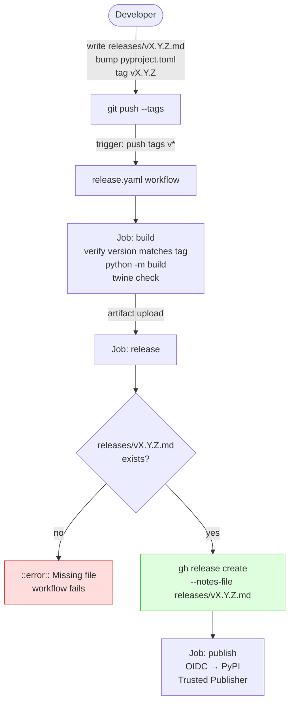

# v1.47.1 — Release Infra: Narrative Per-File Notes

**Released:** 2026-04-11
**Type:** Infrastructure (no package code changes)
**Audience:** Anyone watching fs-mcp releases — this is the first release using the new notes pipeline.

---

## TL;DR

Starting with this release, every fs-mcp tag reads its release body from a hand-written file at `releases/vX.Y.Z.md` instead of auto-generating a "What's Changed" wall from `git log --pretty=format`. The workflow fails loudly if the file is missing, so future releases can't ship an empty stub by accident.

This release is itself infra-only — no `src/fs_mcp/` code changed. You're reading the first Pattern C release notes fs-mcp has ever shipped.

---

## Why This Release Exists

The old `.github/workflows/release.yaml` used a bash heredoc that shelled out to `git log --pretty=format="- %s (%h)"` to build the release body at tag time. It worked — but the output was a bare bullet list grouped by conventional-commit prefix, with no TL;DR, no diagrams, no upgrade notes, and no voice. Six months later, anyone landing on a GitHub Release page for fs-mcp had no idea what the release was actually for.

A parallel project (`@luutuankiet/mcp-proxy-shim`) hit the same wall and migrated to **Pattern C: narrative per-file** on 2026-04-11. It shipped as `v1.5.0` with a ~155-line hand-written file describing the overflow-to-file bypass — mermaid diagrams included, native GitHub rendering, zero guessing about what changed. The approach was then canonicalized into a `release-patterns` skill with a decision matrix, workflow template, and authoring index.

This release is fs-mcp mirroring that migration. The plan is tracked in `gsd-lite/WORK.md` LOG-026.

---

## Highlights

| Change | What it does | Why it matters |
|---|---|---|
| **`releases/` directory** | New home for hand-written release narratives. `README.md` documents the authoring contract. | Release notes become artifacts you can review, diff, and link — not fire-and-forget CI output. |
| **Fail-loud verify step** | New workflow step checks `releases/${{ github.ref_name }}.md` exists before calling `gh release create`. | Prevents empty-stub releases. If you forget to write the narrative, the tag build fails with `::error::Missing releases/vX.Y.Z.md` — you notice immediately. |
| **`--notes-file` instead of heredoc** | The `Create GitHub Release` step now uses `gh release create --notes-file releases/vX.Y.Z.md`. | The entire bash heredoc + `git log --pretty=format` pipeline is gone. Simpler workflow, fewer moving parts, no `/tmp/release-body.md` artifact. |
| **Retired `CHANGELOG.md`** | The stale auto-generated `CHANGELOG.md` (last updated 2026-01-06, pre-v1.42.0) is removed from the repo. | One source of truth. `releases/` + GitHub Releases replace it. A pointer note in `releases/README.md` records the retirement. |

---

## How It Works



---

## Before / After

### Before (v1.47.0 and earlier)

`.github/workflows/release.yaml` built the release body in-workflow:

```yaml
- name: Generate release notes
  run: |
    PREV_TAG=$(git describe --tags --abbrev=0 HEAD^ 2>/dev/null || echo "")
    TAG="${{ github.ref_name }}"
    {
      echo "## What's Changed"
      for prefix_label in "feat:Features" "fix:Bug Fixes" ...; do
        items=$(git log "$PREV_TAG..$TAG" --format="- %s (%h)" --grep="^${prefix}")
        ...
      done
      echo "**Full Changelog**: https://github.com/.../compare/${PREV_TAG}...${TAG}"
    } > /tmp/release-body.md

- name: Create GitHub Release
  run: gh release create "${{ github.ref_name }}" --notes-file /tmp/release-body.md
```

Output on a GitHub Release page: a categorized bullet list, no voice, no context, no diagrams.

### After (v1.47.1)

```yaml
- name: Verify release notes file exists
  run: |
    NOTES_FILE="releases/${{ github.ref_name }}.md"
    if [ ! -f "$NOTES_FILE" ]; then
      echo "::error::Missing $NOTES_FILE. Every tag needs a hand-written narrative entry."
      echo "::error::See releases/README.md for the authoring pattern."
      exit 1
    fi
    echo "Found $NOTES_FILE ($(wc -l < $NOTES_FILE) lines)"

- name: Create GitHub Release from narrative notes file
  env:
    GH_TOKEN: ${{ github.token }}
  run: |
    gh release create "${{ github.ref_name }}" \
      --title "${{ github.ref_name }}" \
      --notes-file "releases/${{ github.ref_name }}.md"
```

Output on a GitHub Release page: this file, rendered natively, with the mermaid diagram above live.

---

## Upgrade Notes

**For maintainers cutting the next fs-mcp release:**

1. Write `releases/vX.Y.Z.md` **before** tagging. Use this file or `releases/README.md` as a template.
2. Bump `pyproject.toml` `version` to match the tag (the existing `Verify version matches tag` step already enforces this — unchanged).
3. Commit both files in the same commit that bumps the version.
4. Tag with `git tag vX.Y.Z && git push --tags`.
5. Watch the workflow. If you forgot step 1, the `Verify release notes file exists` step fails loudly — add the file, re-tag.

**For users:** nothing changes. `pip install fs-mcp` still pulls from PyPI the same way; OIDC Trusted Publishers are still wired up.

---

## Files Changed

| File | Change |
|---|---|
| `releases/README.md` | **new** — authoring index and workflow contract |
| `releases/v1.47.1.md` | **new** — this file |
| `.github/workflows/release.yaml` | heredoc `git log` notes pipeline replaced with `Verify` + `--notes-file` pair |
| `CHANGELOG.md` | **removed** — stale auto-generated history; superseded by `releases/` + GitHub Releases |
| `pyproject.toml` | `version = "1.47.0"` → `"1.47.1"` |

---

## References

- Plan: `gsd-lite/WORK.md` LOG-026 (gitignored — internal context only)
- Canonical Pattern C workflow: `luutuankiet/mcp-proxy-shim:.github/workflows/publish.yml`
- Canonical narrative example: `luutuankiet/mcp-proxy-shim:releases/v1.5.0.md`
- Decision matrix and skill: `luutuankiet/sandbox-cc:.claude/skills/release-patterns/SKILL.md` (Pattern A/B/C comparison)
