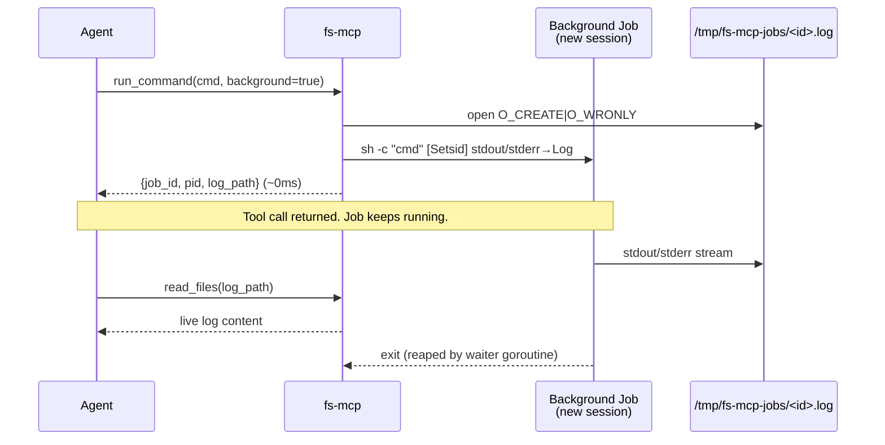

# v2.0.4 — `run_command` background mode

Patch on top of v2.0.3. Restores the v1 pattern for launching jobs that outlive the tool call.

## Why

v1 (Python) had `run_command(background=True)` — a `docker compose build`, a long pytest run, a dev server would spawn detached and return a job handle immediately. The Go rewrite shipped without it, which meant every slow command had to squeeze inside the 120s tool timeout. `setsid cmd &` inside the command body *works* (see v2.0.2 notes), but you still lose the output — it goes nowhere you can read.

This release adds the handle back: `background: true` returns `{job_id, pid, log_path}` in ~0ms, streams merged stdout+stderr to the log, and the caller reads it back with `read_files` or tails it with `grep_content`.

## Highlights

| Change | Effect |
|---|---|
| `background: true` param on `run_command` | Returns a handle, exits the tool call. |
| `setsid` session for each bg job | Job is a session leader — detached from the tool's terminal, reparents cleanly when fs-mcp exits. |
| Merged stdout + stderr → `/tmp/fs-mcp-jobs/<job_id>.log` | One file per job, 0644, never auto-cleaned. |
| Waiter goroutine per job | Exited jobs get reaped; no `<defunct>` accumulation on long-lived servers. |
| `rtk` skipped (`rtk_skipped_by: "background"`) | The log file holds verbatim bytes — compression would defeat the "read it back later" contract. |

## Flow



## Before / After

```bash
# Before (v2.0.3): fits or dies.
run_command "docker compose build", timeout_sec=600
# → blocks 600s, eats the mcp call's budget; if it overruns, SIGKILL.

# After (v2.0.4): fire-and-poll.
run_command "docker compose build", background=true
# → {"job_id":"fsmcp-3f8a...","pid":12345,"log_path":"/tmp/fs-mcp-jobs/fsmcp-3f8a....log"}
# (returns in ~0ms)

# Check progress:
read_files(["/tmp/fs-mcp-jobs/fsmcp-3f8a....log"])
# Or tail live with grep:
grep_content("ERROR|warning", paths=["/tmp/fs-mcp-jobs/fsmcp-3f8a....log"])

# Check liveness:
run_command "ps -p 12345 -o stat,etime,cmd"
```

## Field reference

New fields on the `run_command` output (all `omitempty`, so foreground output is unchanged):

| Field | Type | When present |
|---|---|---|
| `background` | bool | Always true when bg mode was requested |
| `job_id` | string | `fsmcp-<8 hex>` — also the log filename prefix |
| `pid` | int | Session leader pid (= pgid = sid) |
| `log_path` | string | Absolute path to the merged stdout/stderr log |

Foreground output schema is untouched.

## What it does not do

- **No TTL / cleanup.** Logs under `/tmp/fs-mcp-jobs/` live until the tempdir is cleared. A future release can add a reaper; for now the operator wipes the dir manually if needed.
- **No `check_job` or `kill_job` tool.** The existing tools cover it: `read_files` for progress, `run_command "ps -p <pid>"` for liveness, `run_command "kill <pid>"` to stop.
- **No stdin.** Background jobs get `/dev/null` on stdin — interactive commands need to be made non-interactive by the caller.

## Upgrade

Restart the fs-mcp server. Auto-updater picks up v2.0.4 on cold start. No tool contract breakage — foreground callers see identical behavior.

## Files changed

- `internal/runtime/exec.go` — `BackgroundJob` type, `RunShellBackground` (setsid + log file + reaper goroutine), job-dir helper
- `internal/tools/run.go` — `Background` input field + branch, four new optional output fields, updated tool description
- `internal/runtime/exec_test.go` (new) — covers: launch+log capture, session leadership, cwd propagation, merged stderr, zombie reaping
- `releases/README.md` — index entry
