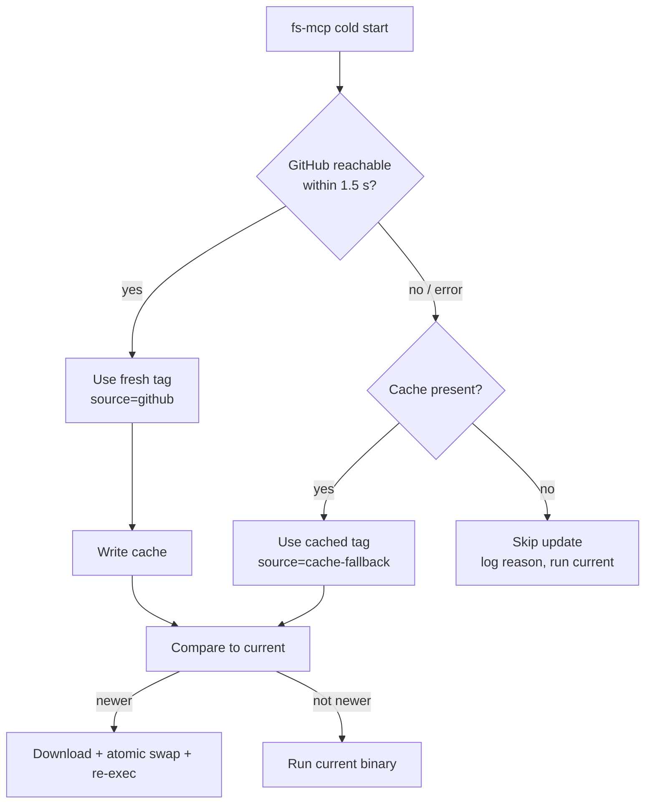

# v2.0.5 — Auto-updater always asks GitHub first

Patch on top of v2.0.4. Removes the 24-hour cache gate that was delaying fleet-wide rollouts by a day.

## Why

Since v2.0.0 the self-updater kept a daily cache at `~/.local/state/fs-mcp/last-check.json`. On cold start it read the cache, and only hit `api.github.com/releases/latest` when the cache was stale. That was cheap, but it meant a freshly-tagged release could sit for up to 24 hours on a host that restarted in the meantime — unless an operator manually busted the cache. The v2.0.4 rollout hit exactly this: fleet restart did nothing until every host's `last-check.json` was deleted.

The cache wasn't earning its keep:

- GitHub's unauthenticated rate limit is 60 req/hour per IP. Even an aggressive restart cycle on one machine never comes close, let alone across a small fleet.
- The network call is already bounded by a 1.5 s hard timeout, so "cold-start stays fast" was already guaranteed independent of the cache.

## What changed

`resolveLatest` now **always** calls GitHub first. The cache is still written on every successful fetch, but it's only *read* as a fallback — if GitHub is unreachable, slow past 1.5 s, or returns an error, the updater falls back to the last known tag so startup never blocks on a broken network.

Net effect on the upgrade loop:

| Step | Before (v2.0.0 – v2.0.4) | After (v2.0.5+) |
|---|---|---|
| Tag a new release | CI builds + publishes | CI builds + publishes |
| Restart fs-mcp | Reads yesterday's cache → no-op | Fetches latest tag → swaps binary |
| Cache busting required? | **Yes** (`rm last-check.json` first) | **No** — restart is the trigger |
| Offline-safe? | Yes (cache) | Yes (cache-fallback) |

## Flow



## Field behavior

| Scenario | Returned source | Returned tag | Cache after |
|---|---|---|---|
| GitHub OK | `github` | fresh tag | refreshed |
| GitHub timeout, cache exists | `cache-fallback` | last-known tag | unchanged |
| GitHub timeout, no cache | — (error) | — | unchanged |

The old "source=cache" value is gone — if you see it in logs on a v2.0.5+ host, the updater didn't run.

## Upgrade

**First v2.0.4 → v2.0.5 hop still needs a cache bust** because v2.0.4 still has the old gate:

```bash
rm -f $HOME/.local/state/fs-mcp/last-check.json
# then restart the fs-mcp upstream
```

**Subsequent upgrades are one-restart.** Once v2.0.5 is in, every future release lands on the next respawn — no cache bookkeeping, no fleet-wide manual step. The operator script in `manage-mcp-proxy/docs/fs-mcp-fleet-upgrade.md` will be trimmed accordingly.

The pin mechanism (`scripts/install.sh vX.Y.Z` writes `pinned-version`) is unchanged; pinning continues to short-circuit the network call entirely.

## Files changed

- `internal/updater/updater.go` — `resolveLatest` rewritten: network-first, cache-fallback. New package var `fetchLatest` so tests can stub the GitHub call.
- `internal/updater/cache.go` — dropped `cacheTTL` constant and `cacheAlive` helper. `CheckedAt` is retained for operator debugging (last successful fetch time).
- `internal/updater/updater_test.go` (new) — covers: network-wins-over-cache, network-fail-fallback-to-cache, network-fail-no-cache-propagates-error, cache-write-idempotency.
- `releases/README.md` — index entry.
