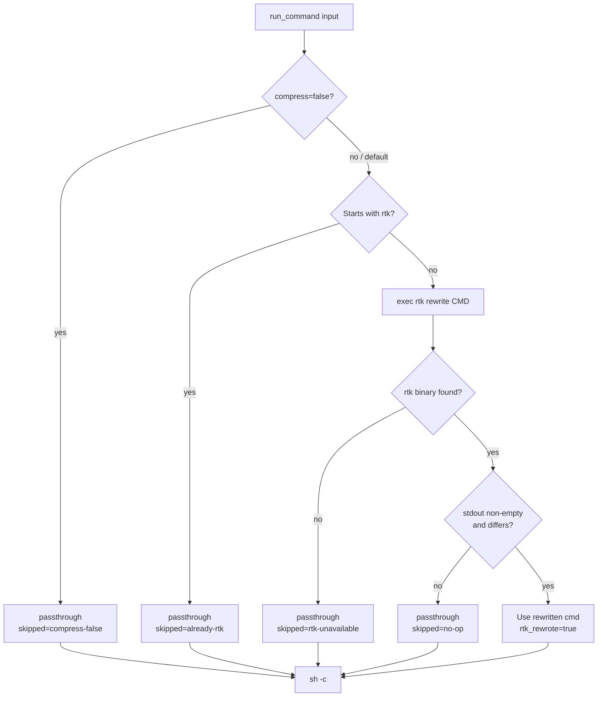

# v2.0.6 — `run_command` delegates rtk wrap to rtk; adds `compress=false` escape hatch

Patch on v2.0.5. Fixes a silent `exit 127` on compound commands that start with a shell builtin (`cd /tmp && git status` and friends), and replaces the bespoke file-redirect escape hatch with an explicit `compress=false` input param.

## Why

Since v1, `run_command` wrapped commands with a string concat:

```go
return "rtk " + command, true, ""
```

That shipped to `sh -c` verbatim. For simple commands (`git status`) and chains whose first token was a real binary (`git fetch && git log`) it worked. For chains whose first token was a shell builtin, it exploded:

```
# user types:
cd /tmp && git status

# we send to sh -c:
rtk cd /tmp && git status

# sh runs:
#   "rtk cd /tmp"   → rtk tries to exec `cd` as a binary → ENOENT (cd is a shell builtin)
#                   → "[rtk: No such file or directory (os error 2)]" → exit 127
#   "&& git status" → short-circuited, never runs
```

Caught mid-PR-review: an agent running `git fetch && git log && git diff` against a remote worktree got exit 127 with nothing in stdout and `rtk_rewrote: true`. The wrap was placing `rtk` in the wrong position of a compound shell line.

The fix for the wrap itself is unambiguous: stop reimplementing a shell lexer and delegate to `rtk rewrite` — the same subcommand the Claude Code rtk hook uses. rtk owns a 1000-line shell tokenizer (`src/discover/lexer.rs`) that handles compound chains, pipe-target-stays-raw, find/fd pipe incompatibility, shell prefix builtins, heredoc and arithmetic bailouts. We had a bug-for-bug reimplementation in 12 lines.

The old escape hatch was a second piece of bespoke logic: a 42-line `hasFileWrite` heuristic that skipped wrapping when the command contained `> file` / `>> file` / `| tee`. The pattern — "redirect to file → raw bytes to disk → read them back with `read_files`" — covered one common case but silently miscompressed other byte-accuracy scenarios:

- `cmd | diff - expected.txt` → rtk wraps `cmd`, diff compares compressed vs. expected, reports bogus diffs
- `cmd | sha256sum` → hashes the compressed bytes, not the raw ones
- `cmd | jq -r …` → jq parses compressed text instead of raw JSON
- Process substitution, `|&`, FD>3 redirects, tee-inside-subshell — all silently misclassified by the parser

The parser answered the wrong question. "Does this write to a file?" is one instance of the real axis: "does a downstream consumer need byte-accurate input?" File redirect, pipe to `diff`, pipe to `sha256sum`, pipe to `jq` — all the same product requirement, only one of which the heuristic caught.

## What changed

**Wrap logic.** `wrapWithRtk` shells out to `rtk rewrite <command>` and uses its stdout as the wrapped result. rtk's lexer handles the hard parts. fs-mcp stops maintaining a parallel shell grammar.

**Escape hatch.** New `compress` input param (default `true`). Set `false` when a downstream consumer reads bytes literally. The tool and param descriptions front-load the "keep it on" guidance so the knob is an honest opt-out, not a lazy "turn compression off" lever.

**Observability.** `rtk_skipped_by` grew three new reasons — `compress-false` (explicit opt-out), `no-op` (rtk saw the command and returned no rewrite, e.g. arithmetic expansion), `rtk-unavailable` (binary not on PATH — graceful fallback). The `file-write` reason is gone. Operators can audit opt-out patterns directly from the response shape.

## Flow



## Before / After

| Case | v2.0.5 | v2.0.6 |
|---|---|---|
| `cd /tmp && git status` | **breaks** — rtk tries to exec `cd`, exit 127, chain aborts | works — rtk rewrites to `cd /tmp && rtk git status` |
| `git status \| head` | `rtk git status \| head` (accidentally correct) | `rtk git status \| head` (correct by design) |
| `find . \| xargs grep foo` | `rtk find . \| xargs grep foo` (wraps find, which shouldn't be wrapped) | unchanged — rtk knows find is pipe-incompatible |
| `cargo fmt && cargo test && git push` | only `cargo fmt` wrapped, rest raw | each segment independently evaluated |
| `echo $((1+2))` | `rtk echo $((1+2))` | passthrough — rtk bails on arithmetic expansion |
| `cmd > /tmp/out` (file-redirect) | skipped via `file-write` heuristic | rtk wraps; use `compress=false` if you need raw bytes |
| `cmd \| diff expected` with byte-exact expectation | silently wrong (compressed vs raw) | use `compress=false`, works |
| rtk not installed | every command breaks (exit 127) | graceful passthrough with `rtk-unavailable` skip reason |

## Configuration

One new input field on `run_command`:

| Name | Type | Default | Meaning |
|---|---|---|---|
| `compress` | bool (optional) | `true` | Compress output via rtk. Set `false` only when downstream consumes bytes literally — `diff`, `sha256sum`, `jq -r`, scripts parsing fixed-format stdin. For human-readable output, leave enabled. |

The tool description and param docstring both front-load the recommendation to keep compression on. `rtk_skipped_by` reports the reason explicitly in every response so opt-out rates are auditable without instrumentation changes.

## Upgrade

Drop-in patch for v2.0.5 fleet hosts. With the v2.0.5 cache-fallback updater, a restart is all it takes — no cache bust needed.

**rtk dependency.** The fix relies on `rtk >= 0.23.0` on PATH (the version that introduced `rtk rewrite`). Older rtk or missing rtk → graceful passthrough without compression and `rtk_skipped_by=rtk-unavailable` in the response. `fs-mcp -doctor` on upgrade will verify rtk is current.

**Behavior change worth flagging.** The old `file-write` escape hatch (redirect to file → skip rtk) is gone. Agents that relied on `cmd > /tmp/out` producing raw bytes need to set `compress=false` explicitly going forward. For human-readable output written to a file (the common case), rtk compression into the file is typically what the caller wanted anyway, so most workflows are unaffected. The breakage surface is narrow: byte-exact scripts (checksums, diffs, binary pipes into further tooling) — those cases now explicitly opt out of compression.

## Files changed

- `internal/tools/run.go` — `wrapWithRtk` rewritten to delegate to `rtk rewrite`; new `Compress *bool` input field; `hasFileWrite` + its 42 lines of bespoke quote-aware shell scanning deleted. Tool description and param docstrings front-load the compression recommendation. Net: -62 / +44.
- `internal/tools/run_test.go` (new) — seven unit tests: explicit `compress=false` opt-out, empty command, `already-rtk` fast path, simple rewrite (live rtk), **regression guard** that `cd /tmp && ls` never produces `rtk cd /tmp && ls`, unsupported (arithmetic) → `no-op`, rtk-unavailable graceful fallback.
- `releases/README.md` — index entry.

**Full Changelog**: https://github.com/luutuankiet/fs-mcp/compare/v2.0.5...v2.0.6
