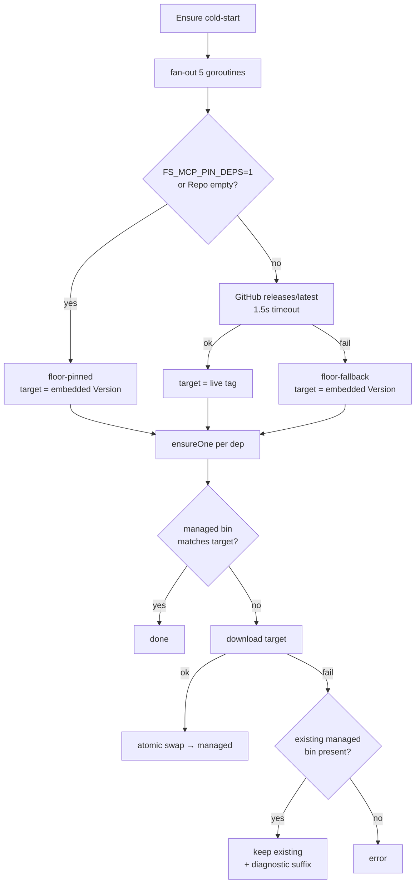

# v2.0.7 — managed deps auto-upgrade on cold start, with graceful floor fallback

Patch on v2.0.6. Reframes embedded dep `Version` as a floor (not a pin); each cold start asks GitHub `releases/latest` per dep and prefers that tag. Upstream check failure or download failure falls back to the floor / existing binary so a broken network never blocks startup.

## Why

`fs-mcp -doctor` on a fleet host reported every managed dep on its embedded pin, even when upstream had cut newer releases months earlier:

```
DEP      VERSION    SOURCE     PATH
rtk      0.37.1     managed    /home/ken/.local/bin/rtk
```

Upstream `rtk v0.40.0` had been available since early 2026. The bump chain to actually roll it onto the fleet was five manual steps per dep:

1. Edit `manifest.go` — five URL strings + `Version` + `VersionContains` per dep.
2. Commit + push.
3. Tag a new fs-mcp release.
4. Goreleaser cuts the release.
5. Each host's `internal/updater` self-swaps fs-mcp on cold start → new fs-mcp re-downloads dep.

The bottleneck was a category error: deps were treated as part of `fs-mcp`'s own version contract. They shouldn't be. They're side-installed utility binaries; staying current matters more than per-fs-mcp-release reproducibility.

The v2.0.0 design called this out and accepted it — *"No rolling remote check (deliberate simplification)"*. v2.0.7 reverses that decision now that the operational pain (manual rtk bumps) outweighs the simplicity benefit.

## What changed

**`Version` is now a floor, not a pin.** Each dep gains a `Repo` field (`"rtk-ai/rtk"`, `"jqlang/jq"`, etc.). On cold start, `Ensure()` fans out five concurrent `releases/latest` API calls (1.5s per-dep timeout) and prefers the live tag. The embedded `Version` is only consulted when:

- the repo is unconfigured for auto-upgrade (`Repo` empty), OR
- the upstream API is unreachable AND no managed binary exists yet (first-install on a broken-network host), OR
- the operator sets `FS_MCP_PIN_DEPS=1` (air-gap / fleet-freeze override).

**Graceful fallback on download failure.** If the upstream API says "latest is v0.40.0" but the asset download 500s, `ensureOne()` keeps the existing managed binary and surfaces a diagnostic Source string in `-doctor`:

```
rtk      0.37.1     managed (upgrade to v0.40.0 failed: download rtk: HTTP 503)
```

Bootstrap completes, fs-mcp keeps booting, operator can see exactly what's stuck without parsing log lines.

**Cold-start latency is bounded.** Tag resolution runs in parallel across deps — worst case is ~1.5s regardless of how many deps the manifest grows to. The existing `internal/updater` already adds ~1.5s for fs-mcp self-update; this adds at most 1.5s more for bootstrap (typically less; `releases/latest` is fast).

## Flow



## Before / After

| Scenario | v2.0.6 | v2.0.7 |
|---|---|---|
| Cold start, upstream has newer rtk | doctor shows pinned 0.37.1; no upgrade | doctor installs v0.40.0 automatically |
| GitHub API unreachable | no API call — always pinned | falls back to embedded floor; doctor notes "pinned to floor" |
| Asset download 503s | bootstrap fails outright if no existing bin | keeps existing managed bin; doctor diagnostic suffix |
| Operator wants fleet-frozen behavior | revert to manual pin in source | set `FS_MCP_PIN_DEPS=1` and restart — no code change |
| Bump tracked dep (e.g. rtk 0.37 → 0.40) | 5-step manual chain across fs-mcp release | zero work — next cold-start restart picks it up |

## Configuration

One new env var:

| Name | Default | Meaning |
|---|---|---|
| `FS_MCP_PIN_DEPS` | unset | When set to `1`, disables upstream API checks and uses the embedded floor (`dep.Version`) for every dep. Mirrors `FS_MCP_NO_AUTO_UPDATE=1` for the fs-mcp self-updater. Useful for air-gapped hosts or freezing a fleet to a specific dep snapshot without recutting fs-mcp. |

No new flags. `--doctor` and `--skip-bootstrap` behavior unchanged otherwise.

## Upgrade

Standard auto-update path. With the v2.0.5 cache-fallback updater, a restart is all it takes — no per-host SSH required.

**Behavior change worth flagging.** Hosts that restart after this lands will see deps actually move. If your workflow depends on a specific managed-dep version pinned to `fs-mcp`'s release cadence (e.g. rtk 0.37.x for some compatibility reason), set `FS_MCP_PIN_DEPS=1` in the environment that launches fs-mcp before restart, then plan a maintenance window to update the embedded floor and re-test.

**GitHub API rate limit.** Unauthenticated `api.github.com/repos/{owner}/{repo}/releases/latest` is capped at 60 req/hr per IP. Worst case is 5 deps × N restart-cycles-per-hour-per-host. A 4-host fleet at one restart per hour is 20 calls/hr — comfortable headroom under the 60/hr cap.

## Files changed

- `internal/bootstrap/manifest.go` — `Dep` struct gains `Repo`; `URL`/`Member`/`VersionContains` now take `tag` parameter; per-dep templates rewritten to interpolate the resolved tag instead of hardcoding the version per release.
- `internal/bootstrap/install.go` — `Ensure()` fan-outs parallel tag resolution via goroutines; `ensureOne()` decision tree handles graceful fallback to existing managed binary on download failure; new `currentVersion` + `truncateErr` helpers for the diagnostic Source string; `resolveTarget` honors `FS_MCP_PIN_DEPS=1`.
- `internal/bootstrap/remote.go` (new) — `FetchLatestTag(ctx, repo)` mirrors `internal/updater/github.go` pattern (1.5s timeout, `releases/latest`, JSON `tag_name`). Duplicated rather than imported to avoid `internal/bootstrap → internal/updater` import cycle.

**Full Changelog**: https://github.com/luutuankiet/fs-mcp/compare/v2.0.6...v2.0.7
